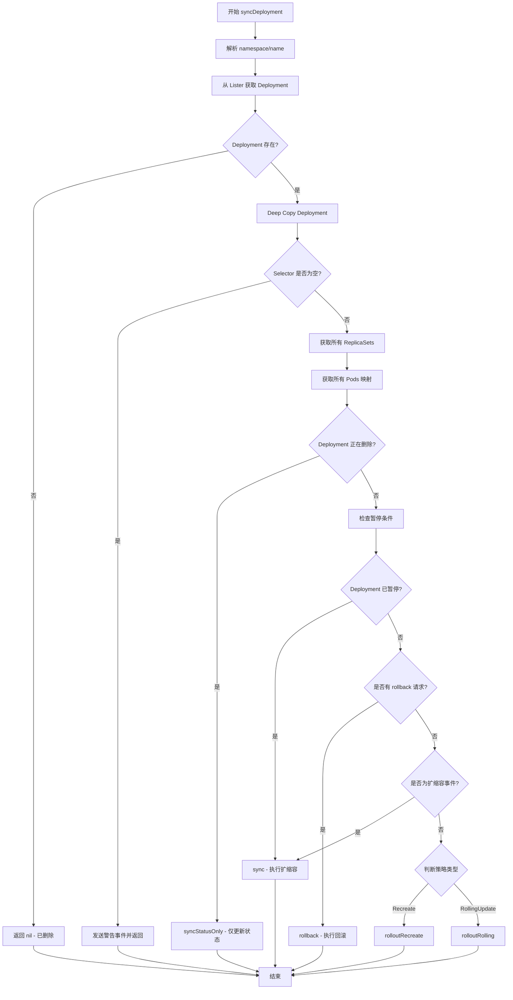

# Kubernetes Controller 常见问题解答

## Deployment Controller

### Q1: syncDeployment() 的工作内容是什么?

**位置**: [pkg/controller/deployment/deployment_controller.go:590](../pkg/controller/deployment/deployment_controller.go#L590)

`syncDeployment()` 是 Deployment Controller 的核心同步函数,负责将 Deployment 的期望状态与实际状态进行协调。这个函数不会被并发调用(同一个 key)。

#### 主要工作流程



#### 详细步骤说明

**1. 前置处理 (deployment_controller.go:590-625)**
- 解析 key 获取 namespace 和 name
- 从 Lister 缓存中获取 Deployment 对象
- 如果不存在(已删除),直接返回
- Deep Copy Deployment 避免修改缓存
- 检查 Selector 是否为空(不允许选择所有 Pods)

**2. 获取关联资源 (deployment_controller.go:627-641)**
```go
// 获取所有归属于此 Deployment 的 ReplicaSets
// 同时进行 ControllerRef 协调(adoption/orphaning)
rsList, err := dc.getReplicaSetsForDeployment(ctx, d)

// 获取所有归属于此 Deployment 的 Pods
// 按 ReplicaSet UID 分组
podMap, err := dc.getPodMapForDeployment(d, rsList)
```

**3. 删除处理 (deployment_controller.go:643-645)**
- 如果 Deployment 有 DeletionTimestamp,只同步状态不做操作

**4. 暂停/恢复处理 (deployment_controller.go:647-656)**
```go
// 更新暂停/恢复条件,防止 progressDeadlineSeconds 超时
dc.checkPausedConditions(ctx, d)

// 如果已暂停,只执行扩缩容,不执行滚动更新
if d.Spec.Paused {
    return dc.sync(ctx, d, rsList)
}
```

**5. 回滚处理 (deployment_controller.go:658-663)**
- 检查是否有回滚请求 (deprecated annotation)
- 执行回滚操作

**6. 扩缩容检测 (deployment_controller.go:665-671)**
- 通过检查 ReplicaSet 的 `deployment.kubernetes.io/desired-replicas` annotation
- 如果是纯扩缩容事件,执行 `sync()` 而不是完整的 rollout

**7. 策略执行 (deployment_controller.go:673-679)**
```go
switch d.Spec.Strategy.Type {
case apps.RecreateDeploymentStrategyType:
    // 先停止所有旧 Pods,再创建新 Pods
    return dc.rolloutRecreate(ctx, d, rsList, podMap)
case apps.RollingUpdateDeploymentStrategyType:
    // 滚动更新:逐步替换旧 Pods
    return dc.rolloutRolling(ctx, d, rsList)
}
```

#### 关键子函数

**getReplicaSetsForDeployment()** ([deployment_controller.go:525](../pkg/controller/deployment/deployment_controller.go#L525))
- 列出所有 ReplicaSets
- 使用 ControllerRefManager 进行协调
- 领养(adopt)匹配的孤儿 ReplicaSets
- 释放(orphan)不再匹配的 ReplicaSets

**getPodMapForDeployment()** ([deployment_controller.go:558](../pkg/controller/deployment/deployment_controller.go#L558))
- 根据 Deployment 的 Selector 获取所有 Pods
- 按 ControllerRef 分组到对应的 ReplicaSet
- 用于 Recreate 策略验证所有旧 Pods 已停止

**sync()** ([pkg/controller/deployment/sync.go:57](../pkg/controller/deployment/sync.go#L57))
- 获取新旧 ReplicaSets 并同步 revision
- 执行按比例扩缩容 (proportional scaling)
- 如果已暂停且无回滚,清理旧 ReplicaSets
- 同步 Deployment 状态

**rolloutRolling()** ([pkg/controller/deployment/rolling.go:31](../pkg/controller/deployment/rolling.go#L31))
- 获取新旧 ReplicaSets,必要时创建新 RS
- 扩容新 ReplicaSet (reconcileNewReplicaSet)
- 缩容旧 ReplicaSets (reconcileOldReplicaSets)
- 遵守 MaxUnavailable 和 MaxSurge 限制
- 完成后清理旧 ReplicaSets
- 同步滚动更新状态

**rolloutRecreate()** ([pkg/controller/deployment/recreate.go](../pkg/controller/deployment/recreate.go))
- 首先缩容所有旧 ReplicaSets 到 0
- 等待所有旧 Pods 完全停止
- 然后扩容新 ReplicaSet 到期望副本数

#### 关键特性

1. **幂等性**: 可以安全地重复调用,会检查当前状态并只做必要的操作

2. **渐进式**: 不会一次性完成所有工作,而是每次做一小步然后重新入队

3. **比例扩缩容**: 在滚动更新中,新旧 ReplicaSets 按比例分配副本数,降低风险

4. **状态同步**: 每个分支最后都会更新 Deployment 状态,反映最新的副本数和条件

5. **错误处理**: 任何步骤失败都会返回错误,触发重试机制(最多 15 次)

#### 涉及的主要文件

- [pkg/controller/deployment/deployment_controller.go](../pkg/controller/deployment/deployment_controller.go) - 主控制器和 syncDeployment 函数
- [pkg/controller/deployment/sync.go](../pkg/controller/deployment/sync.go) - 同步、扩缩容、状态更新逻辑
- [pkg/controller/deployment/rolling.go](../pkg/controller/deployment/rolling.go) - 滚动更新策略实现
- [pkg/controller/deployment/recreate.go](../pkg/controller/deployment/recreate.go) - 重建策略实现
- [pkg/controller/deployment/util/](../pkg/controller/deployment/util/) - 工具函数和辅助方法

#### 相关概念

**ReplicaSet Revision**: 每个 ReplicaSet 都有一个 revision 号(annotation),用于:
- 跟踪部署历史
- 支持回滚到指定版本
- 区分新旧 ReplicaSets

**Pod Template Hash**: 通过计算 Pod 模板的 hash 值:
- 生成唯一的 ReplicaSet 名称
- 作为 `pod-template-hash` label 添加到 Pods
- 确保 Deployment 可以正确识别和管理 Pods

**ControllerRef**: OwnerReference 机制:
- 建立 Deployment → ReplicaSet → Pod 的所有权链
- 支持垃圾回收
- 防止多个控制器争抢同一资源

---

