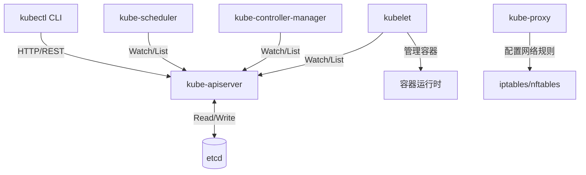

# Kubernetes 项目概览

## 一、核心目录结构与职责

| 目录 | 主要职责 | 关键文件 |
|------|----------|----------|
| **cmd/** | Kubernetes 核心组件的主入口（main 函数） | `kube-apiserver/`, `kube-controller-manager/`, `kube-scheduler/`, `kubelet/`, `kubectl/`, `kube-proxy/`, `kubeadm/` |
| **pkg/** | 核心实现包（业务逻辑、控制器、客户端等） | `pkg/controller/` (各类控制器), `pkg/kubelet/` (节点代理), `pkg/scheduler/` (调度器), `pkg/proxy/` (网络代理), `pkg/kubectl/` (CLI 实现), `pkg/registry/` (API 存储层) |
| **staging/src/k8s.io/** | 独立发布的子仓库（可被外部项目引用） | `client-go/` (客户端库), `api/` (API 类型定义), `apimachinery/` (API 机制), `apiserver/` (API Server 库), `kubectl/` (kubectl 库) |
| **api/** | OpenAPI 规范与 API 定义文件 | `openapi-spec/`, API 发现文件 |
| **test/** | 测试代码（单元测试、集成测试、E2E 测试） | `test/e2e/` (端到端测试), `test/integration/` (集成测试), `test/e2e_node/` (节点级 E2E 测试) |
| **hack/** | 构建、测试、验证脚本（开发工具集） | `hack/make-rules/build.sh`, `hack/make-rules/test.sh`, `hack/verify-all.sh`, `hack/update-vendor.sh` |
| **build/** | 构建配置、容器化构建脚本 | `build/run.sh` (容器化构建), `build/root/Makefile` (主 Makefile) |
| **cluster/** | 集群部署脚本与配置 | 各种云平台的部署脚本 |
| **vendor/** | Go 依赖包（通过 `go mod vendor` 生成） | 第三方依赖代码 |
| **third_party/** | 第三方工具与库（非 Go 依赖） | 外部工具、协议定义等 |
| **plugin/** | Kubernetes 插件示例与接口 | 调度插件、网络插件示例 |

---

## 二、构建与运行方式

### 2.1 构建系统

| 构建方式 | 命令 | 说明 |
|----------|------|------|
| **Makefile** | `make` | 构建 Linux 平台二进制文件（输出到 `_output/`） |
| **指定组件** | `make WHAT=cmd/kubectl` | 只构建特定组件（如 kubectl） |
| **调试构建** | `make DBG=1` | 生成带调试符号的二进制（用于 delve 等调试器） |
| **跨平台编译** | `make cross` | 编译所有平台的二进制文件 |
| **容器化构建** | `build/run.sh make` | 在 Docker 容器中构建（推荐，确保环境一致性） |
| **快速发布** | `make quick-release` | 生成发布版本（Docker 容器中） |

**构建输出目录**: `_output/bin/` (本地构建) 或 `_output/dockerized/bin/` (容器化构建)

### 2.2 测试方式

| 测试类型 | 命令 | 说明 |
|----------|------|------|
| **单元测试** | `make test` | 运行所有单元测试 |
| **指定包测试** | `make test WHAT=./pkg/scheduler` | 测试特定包 |
| **集成测试** | `make test-integration` | 需要 etcd，启动本地 API Server |
| **E2E 测试** | `make test-e2e` | 端到端测试（需要完整集群） |
| **覆盖率测试** | `KUBE_COVER=y make test` | 生成代码覆盖率报告 |

### 2.3 代码验证与更新

| 任务 | 命令 | 说明 |
|------|------|------|
| **代码验证** | `make verify` 或 `hack/verify-all.sh` | 提交 PR 前必须运行 |
| **更新生成代码** | `make update` 或 `hack/update-all.sh` | 更新 protobuf、client、deepcopy 等自动生成的代码 |
| **更新依赖** | `hack/update-vendor.sh` | 更新 `vendor/` 目录 |
| **清理构建产物** | `make clean` | 清理 `_output/` 目录 |

### 2.4 本地运行（开发模式）

Kubernetes 组件通常需要配合运行，推荐使用以下方式：

1. **使用 `hack/local-up-cluster.sh`**: 快速启动本地集群（单节点）
   ```bash
   hack/local-up-cluster.sh
   ```

2. **手动运行组件**（高级用户）:
   ```bash
   # 1. 启动 etcd
   # 2. 启动 kube-apiserver
   _output/bin/kube-apiserver --etcd-servers=http://127.0.0.1:2379 ...
   # 3. 启动 kube-controller-manager
   _output/bin/kube-controller-manager --master=http://127.0.0.1:8080 ...
   # 4. 启动 kube-scheduler
   _output/bin/kube-scheduler --master=http://127.0.0.1:8080 ...
   # 5. 启动 kubelet
   _output/bin/kubelet --kubeconfig=... ...
   ```

---

## 三、外部依赖

### 3.1 核心依赖

| 依赖 | 用途 | 说明 |
|------|------|------|
| **etcd** | 数据存储 | Kubernetes 的核心键值数据库（存储所有集群状态） |
| **Go 1.24.0+** | 编译器 | 项目使用 Go 语言开发（见 `.go-version`） |
| **Docker** | 容器运行时 / 构建工具 | 用于容器化构建、运行容器（生产环境可用 containerd、CRI-O 等） |
| **protobuf** | 序列化协议 | API 对象序列化（通过 `gogo/protobuf`） |
| **gRPC** | RPC 框架 | 部分组件间通信（如 CRI、CSI） |

### 3.2 重要第三方库

| 库 | 用途 |
|------|------|
| `github.com/onsi/ginkgo` | E2E 测试框架 |
| `github.com/onsi/gomega` | 测试断言库 |
| `github.com/spf13/cobra` | CLI 框架（kubectl 等） |
| `github.com/google/cadvisor` | 容器监控（kubelet 集成） |
| `github.com/google/cel-go` | CEL 表达式（策略验证） |
| `go.etcd.io/etcd/client/v3` | etcd 客户端 |
| `k8s.io/klog/v2` | 日志库 |

### 3.3 可选依赖

- **云平台 SDK**: AWS、GCP、Azure 等（用于 cloud-controller-manager）
- **网络插件**: CNI 插件（Flannel、Calico 等，外部安装）
- **存储插件**: CSI 驱动（外部安装）

---

## 四、核心架构概念

### 4.1 Go Workspace 与 Staging 仓库

Kubernetes 使用 **Go Workspace** (`go.work`) 管理多模块项目：

- **主模块**: 根目录 (`k8s.io/kubernetes`)
- **子模块**: `staging/src/k8s.io/*` 下的独立模块（如 `k8s.io/client-go`）

**导入规则**: 在代码中导入 `k8s.io/client-go` 时，实际解析到 `staging/src/k8s.io/client-go/`（开发时），发布后为独立仓库。

### 4.2 核心组件交互



---

## 五、新手阅读顺序建议

### 阶段 1: 快速入门（1-2 天）

1. **阅读文档**
   - `README.md` - 项目简介
   - `CLAUDE.md` - 本项目开发指南
   - `CONTRIBUTING.md` - 贡献指南

2. **理解目录结构**
   - 浏览 `cmd/` 下各组件的 `main.go`（如 `cmd/kubectl/kubectl.go`）
   - 了解 `pkg/` 目录组织（按功能模块划分）

3. **运行示例**
   - 执行 `make` 构建项目
   - 使用 `hack/local-up-cluster.sh` 启动本地集群
   - 运行 `_output/bin/kubectl get nodes` 验证

### 阶段 2: 核心机制理解（1 周）

按以下顺序深入各模块：

#### 2.1 API 机制（最核心）
1. `staging/src/k8s.io/apimachinery/pkg/apis/meta/v1/types.go` - API 元数据类型
2. `staging/src/k8s.io/api/core/v1/types.go` - 核心资源类型（Pod、Service 等）
3. `pkg/apis/core/validation/validation.go` - API 验证逻辑
4. `staging/src/k8s.io/apiserver/pkg/registry/generic/registry/store.go` - 通用存储实现

#### 2.2 控制器模式（Controller Pattern）
1. `pkg/controller/deployment/deployment_controller.go` - Deployment 控制器（最典型）
2. `staging/src/k8s.io/client-go/tools/cache/controller.go` - Informer 机制
3. `pkg/controller/replicaset/replica_set.go` - ReplicaSet 控制器

#### 2.3 核心组件实现
**kubectl**:
- `pkg/kubectl/cmd/get/get.go` - `kubectl get` 命令实现
- `staging/src/k8s.io/kubectl/pkg/cmd/apply/apply.go` - `kubectl apply` 实现

**kube-apiserver**:
- `cmd/kube-apiserver/app/server.go` - 启动入口
- `pkg/kubeapiserver/server/config.go` - 配置逻辑

**kube-scheduler**:
- `pkg/scheduler/scheduler.go` - 调度器主逻辑
- `pkg/scheduler/framework/runtime/framework.go` - 调度插件框架

**kubelet**:
- `pkg/kubelet/kubelet.go` - Kubelet 核心逻辑
- `pkg/kubelet/pod_workers.go` - Pod 生命周期管理

### 阶段 3: 高级主题（持续学习）

1. **性能优化**
   - 缓存机制: `staging/src/k8s.io/client-go/tools/cache/`
   - 并发控制: `staging/src/k8s.io/apiserver/pkg/server/filters/`

2. **扩展机制**
   - 调度插件: `pkg/scheduler/framework/plugins/`
   - Admission Webhook: `staging/src/k8s.io/apiserver/pkg/admission/`

3. **测试最佳实践**
   - 单元测试: 任意 `*_test.go` 文件
   - 集成测试: `test/integration/`
   - E2E 测试: `test/e2e/`

---

## 六、开发流程速查

### 6.1 日常开发循环

```bash
# 1. 修改代码
vim pkg/controller/deployment/deployment_controller.go

# 2. 运行验证（快速检查）
make quick-verify

# 3. 运行单元测试
make test WHAT=./pkg/controller/deployment

# 4. 构建二进制
make WHAT=cmd/kube-controller-manager

# 5. 提交前全量验证
make verify
make test

# 6. 更新生成代码（如果修改了 API 类型）
make update
```

### 6.2 调试建议

- **使用 Delve**: `make DBG=1` 后使用 `dlv exec _output/bin/kube-apiserver`
- **日志级别**: 启动组件时添加 `--v=4`（数字越大越详细，最高 10）
- **查看 API 调用**: 启动 API Server 时添加 `--audit-log-path=/tmp/audit.log`

---

## 七、重要约定与规范

| 约定 | 说明 |
|------|------|
| **代码生成** | 修改 API 类型后必须运行 `make update` 生成代码 |
| **依赖管理** | 使用 `hack/pin-dependency.sh` 固定依赖版本，不要手动编辑 `go.mod` |
| **分支策略** | 主分支为 `master`，发布分支为 `release-X.Y` |
| **Commit 规范** | 遵循 [Kubernetes Commit Message Guidelines](https://www.kubernetes.dev/docs/guide/pull-requests/#commit-message-guidelines) |
| **测试要求** | PR 必须通过 `make verify` 和相关单元测试 |

---

## 八、获取帮助

- **官方文档**: https://kubernetes.io/docs/
- **开发指南**: https://github.com/kubernetes/community/tree/master/contributors/devel
- **API 参考**: https://kubernetes.io/docs/reference/kubernetes-api/
- **社区**: Kubernetes Slack (#kubernetes-dev 频道)
- **问题追踪**: https://github.com/kubernetes/kubernetes/issues

---

## 附录: 常用命令速查表

| 任务 | 命令 |
|------|------|
| 构建所有组件 | `make` |
| 构建 kubectl | `make WHAT=cmd/kubectl` |
| 运行单元测试 | `make test` |
| 运行集成测试 | `make test-integration` |
| 代码验证 | `make verify` |
| 更新生成代码 | `make update` |
| 清理构建产物 | `make clean` |
| 启动本地集群 | `hack/local-up-cluster.sh` |
| 进入构建容器 | `build/shell.sh` |
| 查看构建选项 | `make help` |