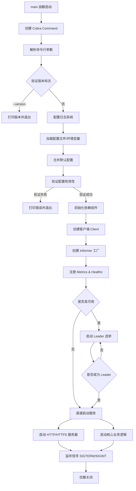
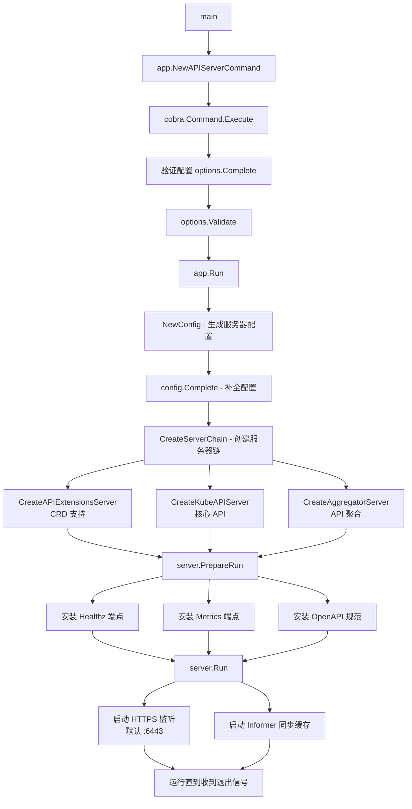
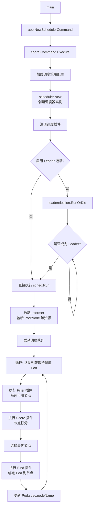
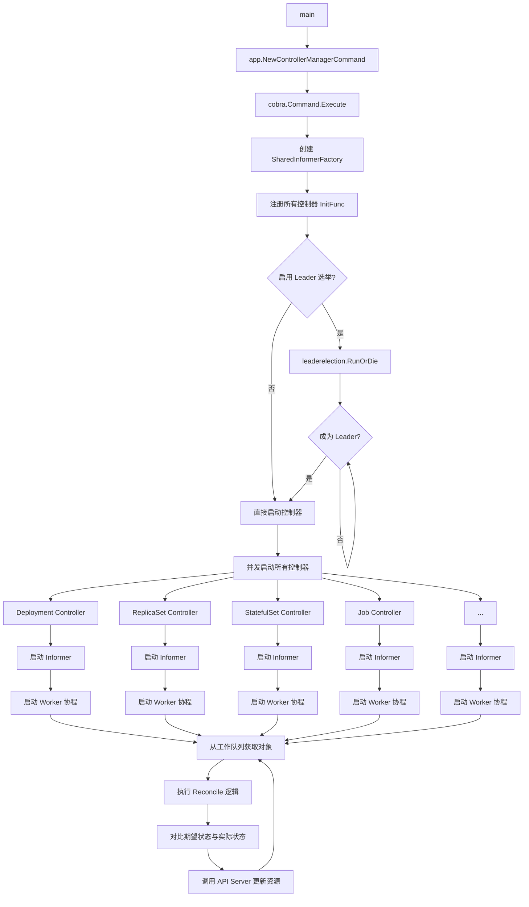
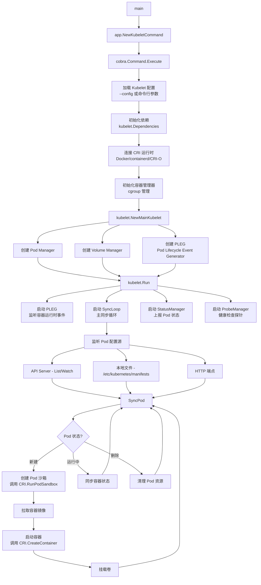
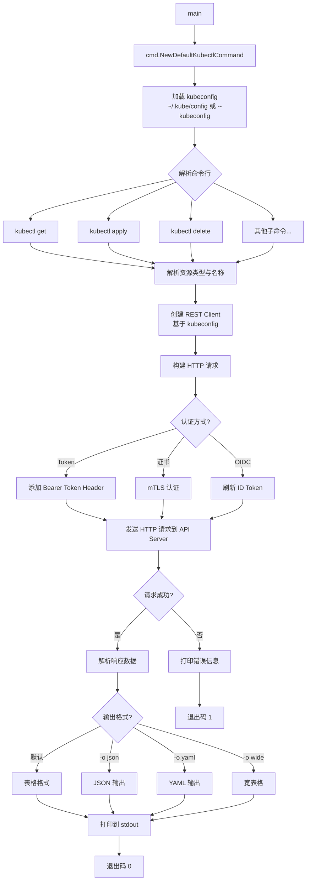

# Kubernetes 程序入口与启动流程

## 一、核心组件入口函数总览

### 1.1 入口文件清单

| 组件 | 入口文件 | main 函数位置 | 说明 |
|------|----------|---------------|------|
| **kube-apiserver** | `cmd/kube-apiserver/apiserver.go:32` | `func main()` | API Server 主入口，提供 Kubernetes REST API |
| **kube-controller-manager** | `cmd/kube-controller-manager/controller-manager.go:34` | `func main()` | 控制器管理器主入口，运行所有核心控制器 |
| **kube-scheduler** | `cmd/kube-scheduler/scheduler.go:29` | `func main()` | 调度器主入口，负责 Pod 调度到节点 |
| **kubelet** | `cmd/kubelet/kubelet.go:35` | `func main()` | 节点代理主入口，管理容器生命周期 |
| **kube-proxy** | `cmd/kube-proxy/proxy.go:29` | `func main()` | 网络代理主入口，维护节点网络规则 |
| **kubectl** | `cmd/kubectl/kubectl.go:31` | `func main()` | CLI 工具主入口，与集群交互的命令行接口 |
| **kubeadm** | `cmd/kubeadm/kubeadm.go` | `func main()` | 集群初始化工具 |

### 1.2 通用启动模式

所有核心组件的 `main` 函数都遵循统一模式：

```go
func main() {
    command := app.NewXXXCommand()  // 创建 Cobra 命令
    code := cli.Run(command)         // 执行命令
    os.Exit(code)                    // 退出
}
```

**关键特征**:
- 使用 **Cobra** 框架构建 CLI
- 使用 `k8s.io/component-base/cli` 统一运行逻辑
- 通过 `app` 包封装启动逻辑（位于 `cmd/XXX/app/` 目录）

---

## 二、CLI 框架与命令结构

### 2.1 Cobra 框架使用

Kubernetes 所有命令行工具都基于 **Cobra** (github.com/spf13/cobra) 构建。

#### 服务端组件（单命令模式）

服务端组件（kube-apiserver、kube-scheduler 等）通常只有一个主命令，不包含子命令：

**示例：kube-apiserver** (`cmd/kube-apiserver/app/server.go:69`)

```go
func NewAPIServerCommand() *cobra.Command {
    s := options.NewServerRunOptions()  // 创建配置选项
    ctx := genericapiserver.SetupSignalContext()  // 信号处理

    cmd := &cobra.Command{
        Use: "kube-apiserver",
        Long: `The Kubernetes API server validates and configures data
for the api objects which include pods, services, replicationcontrollers, and
others...`,
        RunE: func(cmd *cobra.Command, args []string) error {
            // 1. 验证版本标志
            verflag.PrintAndExitIfRequested()
            // 2. 配置日志
            logsapi.ValidateAndApply(s.Logs, featureGate)
            // 3. 完成配置
            completedOptions, err := s.Complete(ctx)
            // 4. 验证配置
            completedOptions.Validate()
            // 5. 启动服务
            return Run(ctx, completedOptions)
        },
    }
    // 注册命令行参数
    fs := cmd.Flags()
    namedFlagSets := s.Flags()
    for _, f := range namedFlagSets.FlagSets {
        fs.AddFlagSet(f)
    }
    return cmd
}
```

#### 客户端工具（多命令模式）

**kubectl** 使用多级子命令结构：

**命令层次** (`staging/src/k8s.io/kubectl/pkg/cmd/cmd.go:306`)

```
kubectl
├── Basic Commands (Beginner)
│   ├── create      - 创建资源
│   ├── expose      - 暴露服务
│   ├── run         - 运行 Pod
│   └── set         - 设置资源属性
├── Basic Commands (Intermediate)
│   ├── explain     - 文档说明
│   ├── get         - 获取资源
│   ├── edit        - 编辑资源
│   └── delete      - 删除资源
├── Deploy Commands
│   ├── rollout     - 滚动更新
│   ├── scale       - 扩缩容
│   └── autoscale   - 自动扩缩容
├── Cluster Management Commands
│   ├── certificate - 证书管理
│   ├── cluster-info - 集群信息
│   ├── top         - 资源使用率
│   ├── cordon/uncordon - 节点调度控制
│   ├── drain       - 节点排水
│   └── taint       - 节点污点
├── Troubleshooting and Debugging Commands
│   ├── describe    - 资源详情
│   ├── logs        - 日志查看
│   ├── attach      - 附加到容器
│   ├── exec        - 容器内执行命令
│   ├── port-forward - 端口转发
│   ├── proxy       - API 代理
│   ├── cp          - 文件复制
│   ├── auth        - 认证检查
│   ├── debug       - 调试工具
│   └── events      - 事件查看
├── Advanced Commands
│   ├── diff        - 资源差异对比
│   ├── apply       - 声明式更新
│   ├── patch       - 部分更新
│   ├── replace     - 替换资源
│   ├── wait        - 等待条件满足
│   └── kustomize   - Kustomize 支持
└── Settings Commands
    ├── label       - 标签管理
    ├── annotate    - 注解管理
    └── completion  - Shell 补全
```

**kubectl 命令注册** (`staging/src/k8s.io/kubectl/pkg/cmd/cmd.go:391`)

```go
groups := templates.CommandGroups{
    {
        Message: "Basic Commands (Beginner):",
        Commands: []*cobra.Command{
            create.NewCmdCreate(f, o.IOStreams),
            expose.NewCmdExposeService(f, o.IOStreams),
            run.NewCmdRun(f, o.IOStreams),
            set.NewCmdSet(f, o.IOStreams),
        },
    },
    // ... 其他命令组
}
groups.Add(cmds)  // 添加到根命令
```

### 2.2 插件机制

kubectl 支持外部插件扩展，插件命名规则：`kubectl-<plugin-name>`

**插件发现** (`staging/src/k8s.io/kubectl/pkg/cmd/cmd.go:207`)
- 查找 `PATH` 中以 `kubectl-` 开头的可执行文件
- 自动代理执行，如 `kubectl foo` → 执行 `kubectl-foo`

---

## 三、服务启动流程详解

### 3.1 kube-apiserver 启动流程

**完整调用链**:

```
cmd/kube-apiserver/apiserver.go:main()
  ↓
cmd/kube-apiserver/app/server.go:NewAPIServerCommand()
  ↓ [Cobra RunE]
cmd/kube-apiserver/app/server.go:Run()
  ↓
cmd/kube-apiserver/app/server.go:CreateServerChain()
  ↓
  ├─ CreateAggregatorServer()      (聚合层)
  ├─ CreateKubeAPIServer()         (核心 API)
  └─ CreateAPIExtensionsServer()   (CRD 支持)
  ↓
server.PrepareRun()
  ↓
server.Run()  → 启动 HTTP/HTTPS 服务器
```

**核心步骤** (`cmd/kube-apiserver/app/server.go:148`):

1. **配置加载与验证**
   ```go
   s := options.NewServerRunOptions()          // 创建默认配置
   completedOptions, err := s.Complete(ctx)    // 补全配置
   completedOptions.Validate()                 // 验证配置
   ```

2. **创建服务器链** (`server.go:176`)
   ```go
   config, err := NewConfig(opts)              // 生成服务器配置
   completed, err := config.Complete()
   server, err := CreateServerChain(completed)
   ```
   - **ApiExtensionsServer**: 处理 CustomResourceDefinition (CRD)
   - **KubeAPIServer**: 核心 Kubernetes API（Pod、Service 等）
   - **AggregatorServer**: 聚合外部 API Server（如 metrics-server）

3. **启动服务器**
   ```go
   prepared, err := server.PrepareRun()        // 注册健康检查、Metrics 等
   return prepared.Run(ctx)                    // 启动 HTTP/HTTPS 监听
   ```

**监听端口**:
- `--secure-port` (默认 6443): HTTPS API 端口
- `--insecure-port` (已废弃): HTTP 端口

---

### 3.2 kube-scheduler 启动流程

**调用链**:

```
cmd/kube-scheduler/scheduler.go:main()
  ↓
cmd/kube-scheduler/app/server.go:NewSchedulerCommand()
  ↓ [Cobra RunE]
cmd/kube-scheduler/app/server.go:Run()
  ↓
  ├─ 配置加载 (Setup)
  ├─ Leader 选举 (LeaderElection)
  └─ 调度主循环 (sched.Run())
```

**核心流程** (`cmd/kube-scheduler/app/server.go:171`):

1. **创建调度器实例**
   ```go
   sched, err := scheduler.New(...)            // 初始化调度器
   ```

2. **健康检查与 Metrics**
   ```go
   mux.Handle("/healthz", healthz.CheckHandler(...))
   mux.Handle("/metrics", metrics.Handler())
   ```

3. **Leader 选举** (高可用场景)
   ```go
   leaderelection.RunOrDie(ctx, leaderelection.LeaderElectionConfig{
       OnStartedLeading: func(ctx context.Context) {
           sched.Run(ctx)  // 启动调度主循环
       },
   })
   ```

4. **调度主循环** (`pkg/scheduler/scheduler.go`)
   - 从调度队列获取待调度 Pod
   - 运行调度插件（Filter、Score）
   - 绑定 Pod 到节点

---

### 3.3 kube-controller-manager 启动流程

**调用链**:

```
cmd/kube-controller-manager/controller-manager.go:main()
  ↓
cmd/kube-controller-manager/app/controllermanager.go:NewControllerManagerCommand()
  ↓ [Cobra RunE]
cmd/kube-controller-manager/app/controllermanager.go:Run()
  ↓
  ├─ 初始化控制器列表 (InitFunc)
  ├─ Leader 选举
  └─ 启动所有控制器 (StartControllers)
```

**关键步骤**:

1. **控制器注册** (`app/controllermanager.go`)
   ```go
   controllerInitializers := map[string]InitFunc{
       "deployment":           startDeploymentController,
       "replicaset":           startReplicaSetController,
       "statefulset":          startStatefulSetController,
       "daemonset":            startDaemonSetController,
       "job":                  startJobController,
       "cronjob":              startCronJobController,
       "endpoint":             startEndpointController,
       "serviceaccount":       startServiceAccountController,
       // ... 30+ 控制器
   }
   ```

2. **启动控制器**
   ```go
   for controllerName, initFn := range controllerInitializers {
       go initFn(ctx, controllerContext)  // 并发启动
   }
   ```

3. **控制器模式** (以 Deployment 为例)
   - 创建 Informer 监听 API Server 变更
   - 启动 Worker 协程处理事件
   - 执行调谐逻辑（Reconcile）

---

### 3.4 kubelet 启动流程

**调用链**:

```
cmd/kubelet/kubelet.go:main()
  ↓
cmd/kubelet/app/server.go:NewKubeletCommand()
  ↓ [Cobra RunE]
cmd/kubelet/app/server.go:Run()
  ↓
cmd/kubelet/app/server.go:RunKubelet()
  ↓
pkg/kubelet/kubelet.go:Run()
  ↓
  ├─ 启动容器运行时 (CRI)
  ├─ 启动 Pod 管理器
  ├─ 启动卷管理器
  ├─ 启动 PLEG (Pod Lifecycle Event Generator)
  └─ 启动 SyncLoop (同步主循环)
```

**核心步骤** (`cmd/kubelet/app/server.go:526`):

1. **依赖初始化**
   ```go
   kubeDeps, err := UnsecuredDependencies(s)  // 创建依赖
   kubeDeps.ContainerManager = cm.NewContainerManager(...)  // 容器管理器
   ```

2. **启动 Kubelet**
   ```go
   k, err := kubelet.NewMainKubelet(...)      // 创建 Kubelet 实例
   k.Run(podCfg.Updates())                    // 启动主循环
   ```

3. **SyncLoop** (`pkg/kubelet/kubelet.go`)
   - 监听 Pod 变更（API Server、文件、HTTP）
   - 同步 Pod 状态到容器运行时
   - 上报节点状态到 API Server

---

### 3.5 kubectl 执行流程

**调用链**:

```
cmd/kubectl/kubectl.go:main()
  ↓
staging/src/k8s.io/kubectl/pkg/cmd/cmd.go:NewDefaultKubectlCommand()
  ↓ [Cobra 命令匹配]
staging/src/k8s.io/kubectl/pkg/cmd/<subcommand>/<command>.go:RunXXX()
  ↓
  ├─ 加载 kubeconfig (~/.kube/config)
  ├─ 创建 REST Client
  ├─ 调用 API Server
  └─ 格式化输出结果
```

**示例：kubectl get pods** (`pkg/cmd/get/get.go`)

```go
func (o *GetOptions) Run() error {
    // 1. 构建 REST 请求
    r := o.Builder.
        NamespaceParam(o.Namespace).
        ResourceTypeOrNameArgs(...).
        Do()

    // 2. 执行请求获取数据
    infos, err := r.Infos()

    // 3. 打印输出（表格/JSON/YAML）
    printer.PrintObj(infos, o.Out)
}
```

---

## 四、启动流程 Mermaid 图

### 4.1 服务端组件通用启动流程



### 4.2 kube-apiserver 详细启动流程



### 4.3 kube-scheduler 详细启动流程



### 4.4 kube-controller-manager 详细启动流程



### 4.5 kubelet 详细启动流程



### 4.6 kubectl 命令执行流程



---

## 五、HTTP/gRPC 服务识别

### 5.1 HTTP 服务

| 组件 | 默认端口 | 协议 | 关键端点 |
|------|----------|------|----------|
| **kube-apiserver** | 6443 | HTTPS | `/api/v1/*`, `/apis/*`, `/healthz`, `/metrics`, `/openapi/v2` |
| **kube-scheduler** | 10259 | HTTPS | `/healthz`, `/metrics` |
| **kube-controller-manager** | 10257 | HTTPS | `/healthz`, `/metrics` |
| **kubelet** | 10250 | HTTPS | `/pods`, `/stats`, `/healthz`, `/metrics` |
| **kube-proxy** | 10256 | HTTP | `/healthz`, `/metrics` |

**API Server 路由注册** (`staging/src/k8s.io/apiserver/pkg/server/routes/`)
- `/api`: 核心 API 组（Pod、Service 等）
- `/apis`: API 扩展组（Deployment、StatefulSet 等）
- `/healthz`: 健康检查（`/healthz/ping`, `/healthz/etcd`）
- `/metrics`: Prometheus 指标
- `/openapi/v2`: OpenAPI 规范

### 5.2 gRPC 服务

| 服务 | 接口 | 说明 |
|------|------|------|
| **CRI (Container Runtime Interface)** | `runtimeapi.RuntimeService` | Kubelet ↔ 容器运行时（containerd/CRI-O） |
| **CSI (Container Storage Interface)** | `csi.IdentityServer`, `csi.ControllerServer`, `csi.NodeServer` | 存储插件接口 |
| **CNI (Container Network Interface)** | 非 gRPC（JSON-RPC over stdin/stdout） | 网络插件接口 |

**CRI 服务调用** (kubelet → containerd)
```go
// pkg/kubelet/cri/remote/remote_runtime.go
client := runtimeapi.NewRuntimeServiceClient(conn)
resp, err := client.RunPodSandbox(ctx, &runtimeapi.RunPodSandboxRequest{...})
```

---

## 六、配置加载顺序

所有组件配置加载优先级（从高到低）：

1. **命令行参数** (`--flag=value`)
2. **配置文件** (`--config=/path/to/config.yaml`)
3. **环境变量** (`KUBECONFIG`, `KUBERNETES_SERVICE_HOST` 等)
4. **默认值** (代码中硬编码的默认值)

**示例：kubectl 配置加载**
```
1. --kubeconfig 指定的文件
2. $KUBECONFIG 环境变量
3. ~/.kube/config (默认)
4. In-cluster 配置 (/var/run/secrets/kubernetes.io/serviceaccount)
```

---

## 七、关键初始化逻辑

### 7.1 信号处理

所有服务端组件都使用 `genericapiserver.SetupSignalContext()` 处理退出信号：

```go
ctx := genericapiserver.SetupSignalContext()  // 监听 SIGTERM, SIGINT
// 收到信号时，ctx.Done() 被触发，开始优雅关闭
```

### 7.2 Leader 选举

高可用场景下，多个实例需要 Leader 选举（基于 Kubernetes Lease 资源）：

```go
leaderelection.RunOrDie(ctx, leaderelection.LeaderElectionConfig{
    Lock:          resourcelock.New(...),  // Lease 锁
    LeaseDuration: 15 * time.Second,       // 租约时长
    RenewDeadline: 10 * time.Second,       // 续约截止时间
    RetryPeriod:   2 * time.Second,        // 重试间隔
    Callbacks: leaderelection.LeaderCallbacks{
        OnStartedLeading: func(ctx context.Context) {
            run(ctx)  // 成为 Leader 后执行
        },
        OnStoppedLeading: func() {
            os.Exit(1)  // 失去 Leader 后退出
        },
    },
})
```

### 7.3 Informer 同步

所有控制器启动前需等待 Informer 缓存同步完成：

```go
informerFactory := informers.NewSharedInformerFactory(client, resyncPeriod)
informerFactory.Start(ctx.Done())
informerFactory.WaitForCacheSync(ctx.Done())  // 阻塞直到缓存同步
```

---

## 八、调试入口点建议

### 8.1 使用 Delve 调试

**编译带调试符号的二进制**:
```bash
make DBG=1 WHAT=cmd/kube-apiserver
```

**启动调试会话**:
```bash
dlv exec _output/bin/kube-apiserver -- \
  --etcd-servers=http://127.0.0.1:2379 \
  --insecure-port=8080
```

**关键断点位置**:
- `cmd/kube-apiserver/app/server.go:148` (Run 函数)
- `pkg/controller/deployment/deployment_controller.go` (Deployment 控制器)
- `pkg/scheduler/scheduler.go` (调度器主逻辑)

### 8.2 日志级别调整

启动时添加 `--v=<level>` (0-10，数字越大越详细):
```bash
kube-apiserver --v=4  # 推荐调试级别
kube-apiserver --v=8  # 详细 HTTP 请求日志
```

### 8.3 Metrics 与 Profiling

**查看 Metrics**:
```bash
curl -k https://localhost:6443/metrics
```

**启用 pprof 性能分析**:
```bash
# API Server 启动时启用
kube-apiserver --profiling=true

# 访问 pprof 端点
go tool pprof http://localhost:6443/debug/pprof/heap
```

---

## 九、常见启动问题排查

| 问题 | 排查方法 | 常见原因 |
|------|----------|----------|
| **无法连接 etcd** | 检查 `--etcd-servers` 参数 | etcd 未启动或端口错误 |
| **端口被占用** | `netstat -tulnp \| grep <port>` | 多个实例冲突 |
| **证书错误** | 检查 `--cert-dir` 和 `--client-ca-file` | 证书过期或路径错误 |
| **Leader 选举失败** | 查看 `--leader-elect-lease-duration` | 时钟偏移或网络分区 |
| **Informer 同步超时** | 增加 `--min-resync-period` | API Server 响应慢 |
| **插件加载失败** | 检查 `--feature-gates` | 功能门控未启用 |

---

## 十、总结

### 启动流程核心模式

所有 Kubernetes 组件遵循统一启动模式：

```
main() → Cobra Command → 配置加载 → 验证 → 依赖初始化 → Run() → 服务循环
```

### 关键设计原则

1. **统一 CLI 框架**: 使用 Cobra + component-base/cli
2. **配置分离**: 支持命令行参数、配置文件、环境变量
3. **优雅退出**: 信号处理 + Context 取消
4. **高可用**: Leader 选举 + 多实例部署
5. **可观测性**: Metrics + Healthz + Profiling

### 学习路径建议

1. **入门**: 阅读 `cmd/kubectl/kubectl.go` 理解 CLI 框架
2. **进阶**: 跟踪 kube-apiserver 启动流程，理解服务器链
3. **深入**: 分析 kube-controller-manager 控制器注册与启动机制
4. **实践**: 使用 Delve 调试本地 Kubernetes 组件