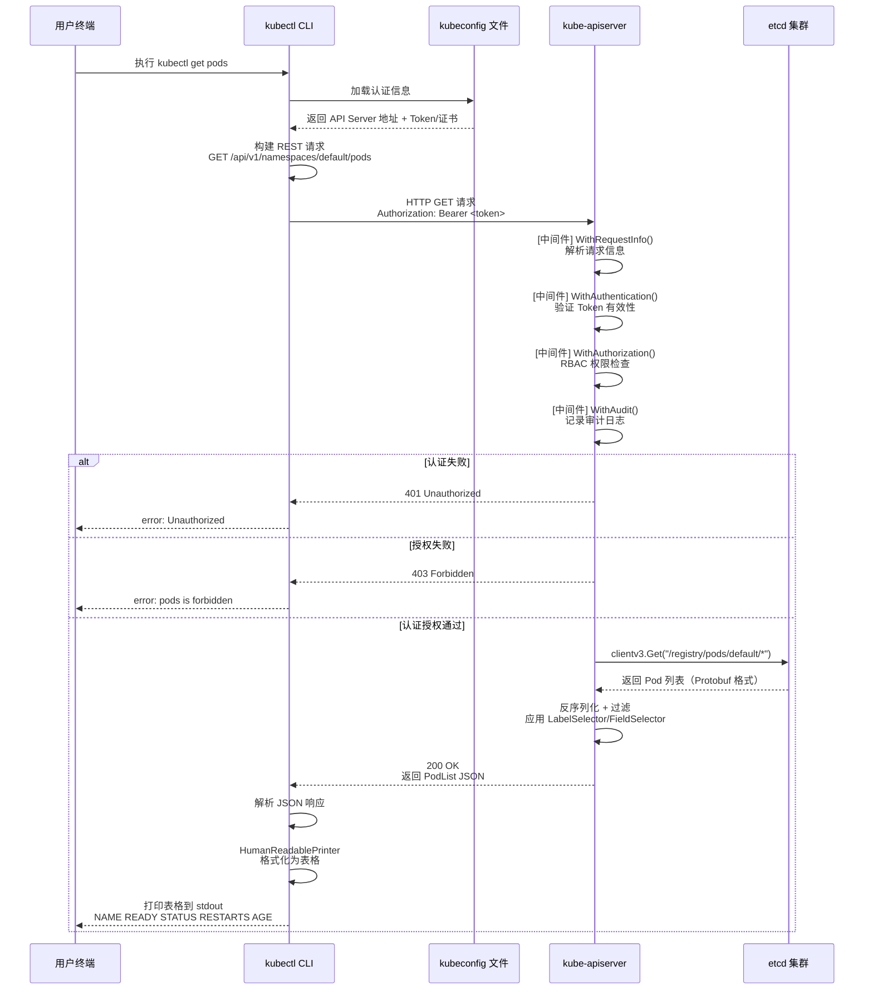
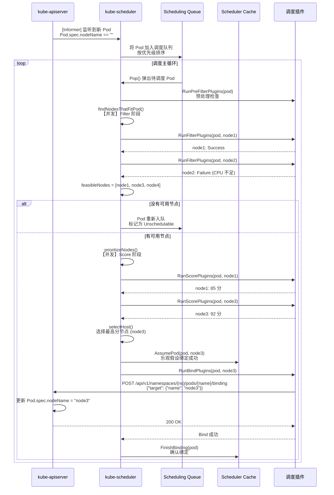
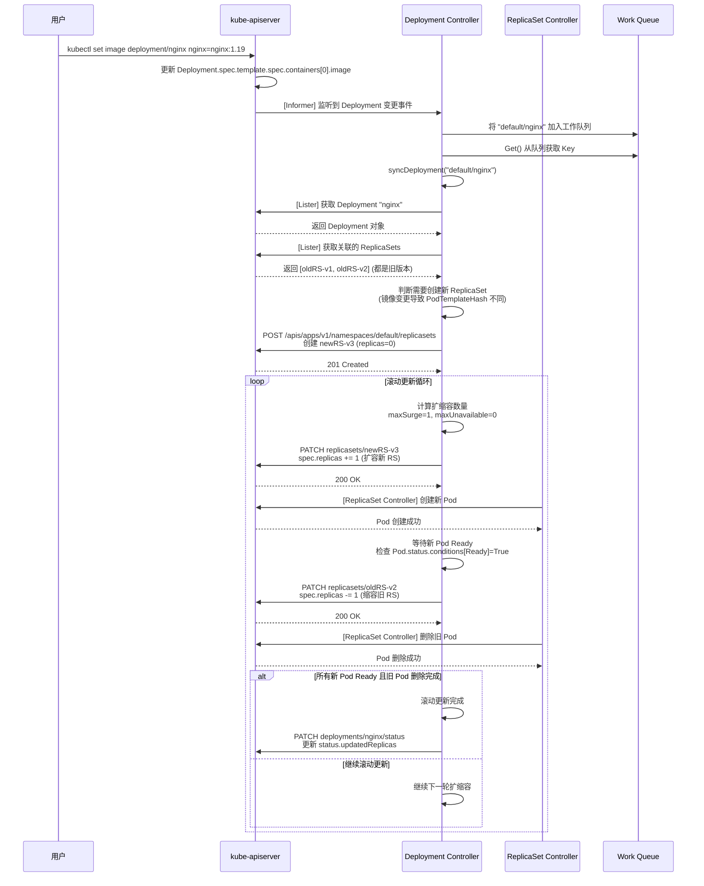
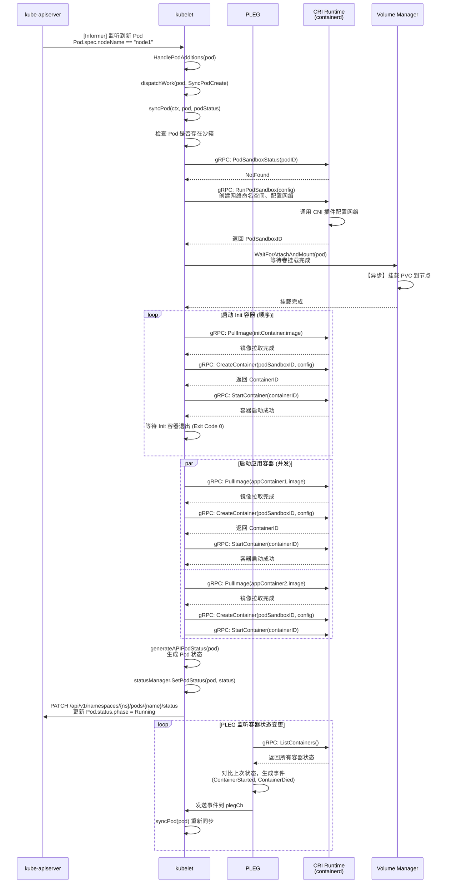

# Kubernetes 核心调用链分析

本文档详细分析 Kubernetes 各核心组件的函数调用链，精确到文件路径和函数名，标注关键分支逻辑。

---

## 一、kube-apiserver 调用链

### 1.1 启动主干调用链

```
main()
  ├─ 文件: cmd/kube-apiserver/apiserver.go:32
  └─ 作用: 程序入口，创建并运行 Cobra 命令

    ↓

app.NewAPIServerCommand()
  ├─ 文件: cmd/kube-apiserver/app/server.go:69
  └─ 作用: 创建 kube-apiserver 的 Cobra 命令对象，注册所有命令行参数

    ↓ [Cobra RunE 钩子]

app.Run(ctx, completedOptions)
  ├─ 文件: cmd/kube-apiserver/app/server.go:148
  └─ 作用: API Server 启动主逻辑，协调配置→创建服务器→启动服务

    ↓

app.NewConfig(opts)
  ├─ 文件: cmd/kube-apiserver/app/server.go:312
  └─ 作用: 生成 API Server 配置对象（包含 Generic、Aggregator、ApiExtensions 三部分）

    ↓

config.Complete()
  ├─ 文件: cmd/kube-apiserver/app/server.go:523
  └─ 作用: 补全配置（默认值、etcd 连接、证书等）

    ↓

app.CreateServerChain(completed)
  ├─ 文件: cmd/kube-apiserver/app/server.go:175
  └─ 作用: 创建三层 API Server 委托链（ApiExtensions → KubeAPI → Aggregator）

    ├─ config.ApiExtensions.New(...)
    │   ├─ 文件: staging/src/k8s.io/apiextensions-apiserver/pkg/apiserver/apiserver.go
    │   └─ 作用: 创建 CRD API Server，处理 CustomResourceDefinition 资源
    │
    ├─ config.KubeAPIs.New(apiExtensionsServer.GenericAPIServer)
    │   ├─ 文件: pkg/controlplane/instance.go:227
    │   └─ 作用: 创建核心 Kubernetes API Server，注册所有内置 API 组（Pod、Service 等）
    │
    └─ controlplaneapiserver.CreateAggregatorServer(...)
        ├─ 文件: pkg/controlplane/apiserver/aggregator.go:40
        └─ 作用: 创建 API 聚合层，代理外部 API Server（如 metrics-server）

    ↓

server.PrepareRun()
  ├─ 文件: staging/src/k8s.io/apiserver/pkg/server/genericapiserver.go:400
  └─ 作用: 准备运行前的最后配置（注册 Healthz、Metrics、OpenAPI 端点）

    ├─ routes.Healthz.Install(...)
    │   └─ 作用: 注册 /healthz 健康检查端点
    │
    ├─ routes.Metrics.Install(...)
    │   └─ 作用: 注册 /metrics Prometheus 指标端点
    │
    └─ routes.OpenAPI.InstallV2(...)
        └─ 作用: 注册 /openapi/v2 OpenAPI 规范端点

    ↓

prepared.Run(ctx)
  ├─ 文件: staging/src/k8s.io/apiserver/pkg/server/genericapiserver.go:451
  └─ 作用: 启动 HTTP/HTTPS 服务器，阻塞直到收到退出信号

    ├─ s.SecureServingInfo.Serve(...)
    │   ├─ 文件: staging/src/k8s.io/apiserver/pkg/server/secure_serving.go
    │   └─ 作用: 启动 HTTPS 监听（默认 :6443）
    │
    ├─ s.RunPostStartHooks(ctx)
    │   └─ 作用: 【并发】运行所有 PostStartHook（如启动 Informer 同步）
    │
    └─ <-stopCh
        └─ 作用: 【阻塞】等待优雅退出信号（SIGTERM/SIGINT）
```

**关键分支标注**:
- **[错误处理]**: 每个函数都有 `if err != nil { return err }` 链式传播
- **[并发]**: `RunPostStartHooks` 使用 goroutine 并发启动后置钩子
- **[中间件链]**: HTTP 请求通过以下中间件（按顺序）：
  ```
  请求 → RequestInfo → Authentication → Authorization → Audit → RateLimiting → 路由处理器
  ```

---

### 1.2 HTTP 请求处理调用链（以 GET /api/v1/pods 为例）

```
HTTP Request: GET /api/v1/pods
  ↓
GenericAPIServer.Handler.ServeHTTP()
  ├─ 文件: staging/src/k8s.io/apiserver/pkg/server/handler.go:80
  └─ 作用: API Server 主路由处理器，分发请求到具体 API 组

    ↓ [中间件链]

WithRequestInfo(handler)
  ├─ 文件: staging/src/k8s.io/apiserver/pkg/endpoints/filters/requestinfo.go
  └─ 作用: 解析请求信息（资源类型、命名空间、动词等）

    ↓

WithAuthentication(handler)
  ├─ 文件: staging/src/k8s.io/apiserver/pkg/endpoints/filters/authentication.go
  └─ 作用: 【关键】认证用户身份（Token、证书、OIDC 等）

    ↓

WithAuthorization(handler)
  ├─ 文件: staging/src/k8s.io/apiserver/pkg/endpoints/filters/authorization.go
  └─ 作用: 【关键】授权检查（RBAC、ABAC、Webhook）

    ↓

WithAudit(handler)
  ├─ 文件: staging/src/k8s.io/apiserver/pkg/endpoints/filters/audit.go
  └─ 作用: 记录审计日志（请求元数据、响应状态）

    ↓ [路由匹配]

ListResource.ServeHTTP()
  ├─ 文件: staging/src/k8s.io/apiserver/pkg/endpoints/handlers/get.go:220
  └─ 作用: 处理 List 请求（GET /api/v1/pods）

    ↓

storage.List(ctx, options)
  ├─ 文件: staging/src/k8s.io/apiserver/pkg/registry/generic/registry/store.go:395
  └─ 作用: 从 etcd 获取资源列表

    ├─ s.Storage.GetList(ctx, key, opts, listObj)
    │   ├─ 文件: staging/src/k8s.io/apiserver/pkg/storage/etcd3/store.go:530
    │   └─ 作用: 【关键】调用 etcd clientv3 API 获取数据
    │
    └─ [错误处理]
        ├─ 如果 etcd 不可用 → 返回 503 ServiceUnavailable
        └─ 如果资源不存在 → 返回 404 NotFound

    ↓

responsewriters.WriteObjectNegotiated()
  ├─ 文件: staging/src/k8s.io/apiserver/pkg/endpoints/handlers/responsewriters/writers.go
  └─ 作用: 序列化对象为 JSON/YAML/Protobuf 并写入响应
```

**关键分支标注**:
- **[认证失败]**: 返回 401 Unauthorized，中断后续处理
- **[授权失败]**: 返回 403 Forbidden，记录审计日志
- **[etcd 超时]**: 返回 504 GatewayTimeout，触发重试（如果配置）
- **[分页]**: 如果 `?limit=100` 参数存在，调用 `storage.ListPredicate` 分页获取

---

## 二、kube-scheduler 调用链

### 2.1 调度器启动调用链

```
main()
  ├─ 文件: cmd/kube-scheduler/scheduler.go:29
  └─ 作用: 程序入口

    ↓

app.NewSchedulerCommand()
  ├─ 文件: cmd/kube-scheduler/app/server.go:89
  └─ 作用: 创建 Scheduler Cobra 命令

    ↓ [Cobra RunE]

app.Run(ctx, cc, sched)
  ├─ 文件: cmd/kube-scheduler/app/server.go:171
  └─ 作用: 启动调度器主循环

    ├─ [条件分支: Leader 选举]
    │   ├─ 如果 --leader-elect=true:
    │   │   └─ leaderelection.RunOrDie(...)
    │   │       ├─ 文件: staging/src/k8s.io/client-go/tools/leaderelection/leaderelection.go
    │   │       └─ 作用: 【并发】竞争 Leader，成为 Leader 后调用 sched.Run()
    │   └─ 否则:
    │       └─ 直接调用 sched.Run(ctx)
    │
    └─ sched.Run(ctx)
        ├─ 文件: pkg/scheduler/scheduler.go:463
        └─ 作用: 启动调度器主循环（从队列获取 Pod → 调度 → 绑定）

          ├─ sched.SchedulingQueue.Run()
          │   ├─ 文件: pkg/scheduler/backend/queue/scheduling_queue.go
          │   └─ 作用: 【并发】启动调度队列（管理待调度 Pod）
          │
          └─ wait.UntilWithContext(ctx, sched.scheduleOne, 0)
              ├─ 文件: k8s.io/apimachinery/pkg/util/wait
              └─ 作用: 【循环】持续调用 scheduleOne 处理 Pod
```

---

### 2.2 单个 Pod 调度调用链

```
scheduleOne(ctx)
  ├─ 文件: pkg/scheduler/scheduler.go:502
  └─ 作用: 从队列获取一个 Pod 并完成调度

    ↓

podInfo := sched.NextPod()
  ├─ 文件: pkg/scheduler/backend/queue/scheduling_queue.go:487
  └─ 作用: 【阻塞】从优先级队列弹出下一个待调度 Pod

    ↓

scheduleResult, err := sched.SchedulePod(ctx, fwk, state, pod)
  ├─ 文件: pkg/scheduler/scheduler.go:738
  └─ 作用: 执行调度算法，选择最优节点

    ↓ [调度核心流程]

    ├─ fwk.RunPreFilterPlugins(ctx, state, pod)
    │   ├─ 文件: pkg/scheduler/framework/runtime/framework.go
    │   └─ 作用: 运行 PreFilter 插件（预处理，如检查 PVC 是否存在）
    │
    ├─ feasibleNodes := findNodesThatFitPod(ctx, fwk, state, pod)
    │   ├─ 文件: pkg/scheduler/schedule_one.go:200
    │   └─ 作用: 【并发】运行 Filter 插件，筛选可调度节点
    │       ├─ NodeUnschedulable: 检查节点是否可调度
    │       ├─ NodeResourcesFit: 检查 CPU/内存是否足够
    │       ├─ NodeAffinity: 检查节点亲和性
    │       └─ PodTopologySpread: 检查拓扑分布约束
    │
    ├─ [错误处理] 如果 len(feasibleNodes) == 0:
    │   └─ 返回 ErrNoNodesAvailable，触发 FailureHandler
    │
    ├─ priorityList := prioritizeNodes(ctx, fwk, state, pod, feasibleNodes)
    │   ├─ 文件: pkg/scheduler/schedule_one.go:320
    │   └─ 作用: 【并发】运行 Score 插件，为节点打分
    │       ├─ NodeResourcesBalancedAllocation: 资源平衡打分
    │       ├─ ImageLocality: 镜像本地性打分
    │       └─ InterPodAffinity: Pod 亲和性打分
    │
    └─ selectedNode := selectHost(priorityList)
        ├─ 文件: pkg/scheduler/schedule_one.go:380
        └─ 作用: 选择得分最高的节点（如果有多个则随机选择）

    ↓

fwk.RunReservePluginsReserve(ctx, state, pod, selectedNode)
  ├─ 文件: pkg/scheduler/framework/runtime/framework.go
  └─ 作用: 运行 Reserve 插件（预留资源，如 DRA 资源）

    ↓

assumedPod := pod.DeepCopy()
assumedPod.Spec.NodeName = selectedNode
sched.Cache.AssumePod(assumedPod)
  ├─ 文件: pkg/scheduler/backend/cache/cache.go:289
  └─ 作用: 【乐观假设】在缓存中假设 Pod 已绑定到节点（避免重复调度）

    ↓

fwk.RunBindPlugins(ctx, state, pod, selectedNode)
  ├─ 文件: pkg/scheduler/framework/runtime/framework.go
  └─ 作用: 【异步】运行 Bind 插件，将 Pod 绑定到节点

    ↓

sched.client.CoreV1().Pods(pod.Namespace).Bind(ctx, &v1.Binding{
    ObjectMeta: metav1.ObjectMeta{Name: pod.Name},
    Target:     v1.ObjectReference{Name: selectedNode},
})
  ├─ 文件: staging/src/k8s.io/client-go/kubernetes/typed/core/v1/pod.go
  └─ 作用: 【关键】调用 API Server 的 /api/v1/namespaces/{ns}/pods/{name}/binding 子资源

    ↓ [API Server 处理]

API Server 接收 Binding 请求 → 更新 Pod.spec.nodeName → etcd 持久化
```

**关键分支标注**:
- **[调度失败]**: 如果所有节点都不满足条件，调用 `FailureHandler` 将 Pod 重新入队
- **[并发优化]**: Filter 和 Score 阶段使用 `parallelize.Until` 并发处理节点（默认 16 并发）
- **[插件扩展点]**: 调度器支持 15+ 扩展点，可插入自定义逻辑
- **[Assume 机制]**: 乐观假设避免调度器等待 API Server 响应，提升吞吐量

---

## 三、kube-controller-manager 调用链

### 3.1 Controller Manager 启动调用链

```
main()
  ├─ 文件: cmd/kube-controller-manager/controller-manager.go:34
  └─ 作用: 程序入口

    ↓

app.NewControllerManagerCommand()
  ├─ 文件: cmd/kube-controller-manager/app/controllermanager.go:129
  └─ 作用: 创建 Controller Manager Cobra 命令

    ↓ [Cobra RunE]

app.Run(ctx, c)
  ├─ 文件: cmd/kube-controller-manager/app/controllermanager.go:209
  └─ 作用: 启动所有控制器

    ├─ [条件分支: Leader 选举]
    │   ├─ 如果 --leader-elect=true:
    │   │   └─ leaderelection.RunOrDie(...)
    │   └─ 否则:
    │       └─ 直接启动控制器
    │
    ├─ StartControllers(ctx, controllerContext)
    │   ├─ 文件: cmd/kube-controller-manager/app/controllermanager.go:500
    │   └─ 作用: 【并发】启动所有注册的控制器
    │
    └─ controllerContext.InformerFactory.Start(ctx.Done())
        └─ 作用: 启动 SharedInformerFactory（监听 API Server 资源变更）
```

---

### 3.2 Deployment Controller 调用链（典型控制器模式）

```
StartDeploymentController(ctx, controllerContext)
  ├─ 文件: cmd/kube-controller-manager/app/apps.go:40
  └─ 作用: 启动 Deployment 控制器

    ↓

deployment.NewDeploymentController(...)
  ├─ 文件: pkg/controller/deployment/deployment_controller.go:100
  └─ 作用: 创建 DeploymentController 实例

    ├─ dInformer.Informer().AddEventHandler(...)
    │   └─ 作用: 注册 Deployment 资源的事件处理器（Add/Update/Delete）
    │
    ├─ rsInformer.Informer().AddEventHandler(...)
    │   └─ 作用: 注册 ReplicaSet 资源的事件处理器
    │
    └─ podInformer.Informer().AddEventHandler(...)
        └─ 作用: 注册 Pod 资源的事件处理器

    ↓

dc.Run(ctx, workers)
  ├─ 文件: pkg/controller/deployment/deployment_controller.go:180
  └─ 作用: 启动控制器 Worker 协程

    ├─ wait.Until(dc.worker, time.Second, stopCh)
    │   └─ 作用: 【并发】启动 N 个 Worker（默认 5 个）
    │
    └─ dc.worker()
        ├─ 文件: pkg/controller/deployment/deployment_controller.go:560
        └─ 作用: 【循环】从工作队列获取 Deployment Key 并处理

          ↓

          key := dc.queue.Get()
          dc.syncHandler(ctx, key)
            ↓

            dc.syncDeployment(ctx, key)
              ├─ 文件: pkg/controller/deployment/deployment_controller.go:590
              └─ 作用: 【核心】同步 Deployment 到期望状态

                ↓

                deployment := dc.dLister.Deployments(namespace).Get(name)
                  └─ 作用: 从本地缓存（Informer）获取 Deployment 对象

                ↓

                rsList := dc.getReplicaSetsForDeployment(deployment)
                  ├─ 文件: pkg/controller/deployment/deployment_controller.go:660
                  └─ 作用: 获取该 Deployment 管理的所有 ReplicaSet

                ↓

                dc.sync(ctx, deployment, rsList)
                  ├─ 文件: pkg/controller/deployment/sync.go:57
                  └─ 作用: 【核心】执行调谐逻辑（Reconcile）

                    ├─ [条件分支: 判断 Deployment 类型]
                    │   ├─ 如果 deployment.Spec.Paused == true:
                    │   │   └─ dc.syncStatusOnly(...)  // 只更新状态，不操作 ReplicaSet
                    │   │
                    │   ├─ 如果 deployment.Spec.Strategy.Type == "Recreate":
                    │   │   └─ dc.rolloutRecreate(...)  // 重建策略：先删除旧 RS，再创建新 RS
                    │   │
                    │   └─ 如果 deployment.Spec.Strategy.Type == "RollingUpdate":
                    │       └─ dc.rolloutRolling(...)  // 滚动更新策略（默认）
                    │
                    ├─ dc.rolloutRolling(ctx, deployment, rsList)
                    │   ├─ 文件: pkg/controller/deployment/rolling.go:35
                    │   └─ 作用: 执行滚动更新逻辑
                    │
                    │     ├─ newRS := dc.getNewReplicaSet(deployment, rsList)
                    │     │   └─ 作用: 获取或创建新版本 ReplicaSet
                    │     │
                    │     ├─ oldRSs := dc.getOldReplicaSets(deployment, rsList)
                    │     │   └─ 作用: 获取所有旧版本 ReplicaSet
                    │     │
                    │     ├─ [关键] 如果 newRS == nil:
                    │     │   └─ dc.client.AppsV1().ReplicaSets(ns).Create(ctx, newRS)
                    │     │       └─ 作用: 创建新版本 ReplicaSet
                    │     │
                    │     ├─ scaledUp := dc.scaleUpNewReplicaSet(newRS, ...)
                    │     │   ├─ 文件: pkg/controller/deployment/rolling.go:120
                    │     │   └─ 作用: 扩容新版本 ReplicaSet（增加 Pod 副本数）
                    │     │
                    │     └─ scaledDown := dc.scaleDownOldReplicaSets(oldRSs, ...)
                    │         ├─ 文件: pkg/controller/deployment/rolling.go:200
                    │         └─ 作用: 缩容旧版本 ReplicaSet（减少 Pod 副本数）
                    │
                    └─ dc.syncDeploymentStatus(ctx, allRSs, newRS, deployment)
                        ├─ 文件: pkg/controller/deployment/sync.go:481
                        └─ 作用: 更新 Deployment.status（可用副本数、条件等）

                ↓

                dc.client.AppsV1().Deployments(ns).UpdateStatus(ctx, deployment)
                  └─ 作用: 调用 API Server 更新 Deployment 状态
```

**关键分支标注**:
- **[事件驱动]**: Informer 监听到 Deployment 变更时，将 Key 加入工作队列
- **[速率限制]**: 如果 syncDeployment 返回错误，使用指数退避重试（最多 15 次）
- **[并发控制]**: 多个 Worker 并发处理不同 Deployment，但同一个 Deployment 串行处理
- **[所有权检查]**: `getReplicaSetsForDeployment` 通过 `OwnerReference` 找到归属的 RS
- **[滚动更新算法]**: 遵循 `maxSurge` 和 `maxUnavailable` 参数控制扩缩容速度

---

## 四、kubelet 调用链

### 4.1 Kubelet 启动调用链

```
main()
  ├─ 文件: cmd/kubelet/kubelet.go:35
  └─ 作用: 程序入口

    ↓

app.NewKubeletCommand()
  ├─ 文件: cmd/kubelet/app/server.go:130
  └─ 作用: 创建 Kubelet Cobra 命令

    ↓ [Cobra RunE]

app.Run(ctx, kubeletServer, kubeletDeps)
  ├─ 文件: cmd/kubelet/app/server.go:526
  └─ 作用: 启动 Kubelet 主逻辑

    ↓

app.RunKubelet(ctx, kubeServer, kubeDeps)
  ├─ 文件: cmd/kubelet/app/server.go:1211
  └─ 作用: 创建并运行 Kubelet 实例

    ↓

kubelet.NewMainKubelet(...)
  ├─ 文件: pkg/kubelet/kubelet.go:450
  └─ 作用: 创建 Kubelet 核心实例（初始化所有子管理器）

    ├─ runtime.NewContainerRuntimeManager(...)
    │   ├─ 文件: pkg/kubelet/kuberuntime/kuberuntime_manager.go
    │   └─ 作用: 创建容器运行时管理器（通过 CRI 与 containerd/CRI-O 通信）
    │
    ├─ volumemanager.NewVolumeManager(...)
    │   ├─ 文件: pkg/kubelet/volumemanager/volume_manager.go
    │   └─ 作用: 创建卷管理器（处理 PVC 挂载/卸载）
    │
    ├─ pleg.NewGenericPLEG(...)
    │   ├─ 文件: pkg/kubelet/pleg/generic.go
    │   └─ 作用: 创建 Pod Lifecycle Event Generator（监听容器运行时事件）
    │
    └─ status.NewManager(...)
        ├─ 文件: pkg/kubelet/status/status_manager.go
        └─ 作用: 创建 Pod 状态管理器（上报 Pod 状态到 API Server）

    ↓

kubelet.Run(podCfg.Updates())
  ├─ 文件: pkg/kubelet/kubelet.go:1626
  └─ 作用: 启动 Kubelet 主循环

    ├─ kl.volumeManager.Run(...)
    │   └─ 作用: 【并发】启动卷管理器
    │
    ├─ kl.pleg.Start()
    │   └─ 作用: 【并发】启动 PLEG（每秒轮询容器运行时）
    │
    ├─ kl.statusManager.Start()
    │   └─ 作用: 【并发】启动状态管理器（每 10 秒上报状态）
    │
    └─ kl.syncLoop(ctx, updates, kl)
        ├─ 文件: pkg/kubelet/kubelet.go:2247
        └─ 作用: 【主循环】同步 Pod 状态
```

---

### 4.2 SyncLoop 核心调用链

```
syncLoop(ctx, updates, handler)
  ├─ 文件: pkg/kubelet/kubelet.go:2247
  └─ 作用: 【无限循环】监听 Pod 配置变更并同步

    ↓ [Select 多路复用]

    select {
      case u := <-configCh:
        // 来自 API Server 的 Pod 更新
        handler.HandlePodAdditions(u.Pods)
        handler.HandlePodUpdates(u.Pods)
        handler.HandlePodRemoves(u.Pods)

      case e := <-plegCh:
        // 来自 PLEG 的容器状态变更事件
        handler.HandlePodSyncs([]*v1.Pod{e.Pod})

      case <-housekeepingCh:
        // 定期清理逻辑（每 2 秒触发）
        handler.HandlePodCleanups(ctx)
    }

    ↓

HandlePodAdditions(pods)
  ├─ 文件: pkg/kubelet/kubelet.go:2350
  └─ 作用: 处理新增 Pod

    ├─ sort.Sort(sliceutils.PodsByCreationTime(pods))
    │   └─ 作用: 按创建时间排序（优先处理旧 Pod）
    │
    └─ for each pod:
        kl.dispatchWork(pod, kubetypes.SyncPodCreate, ...)
          ↓

          kl.podWorkers.UpdatePod(UpdatePodOptions{
              Pod:        pod,
              UpdateType: kubetypes.SyncPodCreate,
          })
            ├─ 文件: pkg/kubelet/pod_workers.go:320
            └─ 作用: 将 Pod 分发到 Worker 协程处理

              ↓

              podWorker.managePodLoop(ctx)
                ├─ 文件: pkg/kubelet/pod_workers.go:580
                └─ 作用: 【并发】每个 Pod 独立的 Worker 协程

                  ↓

                  kl.syncPod(ctx, syncPodOptions)
                    ├─ 文件: pkg/kubelet/kubelet.go:1787
                    └─ 作用: 【核心】同步单个 Pod 到期望状态

                      ├─ [条件分支: 判断 Pod 操作类型]
                      │   ├─ 如果 updateType == kubetypes.SyncPodKill:
                      │   │   └─ kl.killPod(pod, ...)  // 杀死 Pod 所有容器
                      │   │
                      │   └─ 否则:
                      │       └─ 继续创建/更新 Pod
                      │
                      ├─ apiPodStatus := kl.generateAPIPodStatus(pod, podStatus)
                      │   └─ 作用: 生成 Pod 状态（基于容器运行时查询结果）
                      │
                      ├─ kl.statusManager.SetPodStatus(pod, apiPodStatus)
                      │   └─ 作用: 更新 Pod 状态（后续由 statusManager 上报到 API Server）
                      │
                      ├─ [关键] 如果 Pod 不存在沙箱（Sandbox）:
                      │   └─ kl.createPodSandbox(pod)
                      │       ├─ 文件: pkg/kubelet/kuberuntime/kuberuntime_sandbox.go:60
                      │       └─ 作用: 调用 CRI 创建 Pod 沙箱（网络命名空间）
                      │           ↓
                      │           m.runtimeService.RunPodSandbox(config)
                      │             ├─ 文件: staging/src/k8s.io/cri-api/pkg/apis/runtime/v1/api.pb.go
                      │             └─ 作用: 【gRPC】调用容器运行时 RunPodSandbox API
                      │
                      ├─ kl.volumeManager.WaitForAttachAndMount(pod)
                      │   └─ 作用: 【阻塞】等待卷挂载完成
                      │
                      ├─ for each container in pod.Spec.InitContainers:
                      │   └─ kl.startContainer(pod, container, ...)
                      │       └─ 作用: 【顺序】启动 Init 容器
                      │
                      └─ for each container in pod.Spec.Containers:
                          └─ kl.startContainer(pod, container, ...)
                              ├─ 文件: pkg/kubelet/kuberuntime/kuberuntime_container.go:160
                              └─ 作用: 【并发】启动应用容器

                                ├─ m.imagePuller.PullImage(container.Image, ...)
                                │   └─ 作用: 【gRPC】调用 CRI PullImage 拉取镜像
                                │
                                ├─ m.runtimeService.CreateContainer(podSandboxID, config, sandboxConfig)
                                │   └─ 作用: 【gRPC】调用 CRI CreateContainer 创建容器
                                │
                                └─ m.runtimeService.StartContainer(containerID)
                                    └─ 作用: 【gRPC】调用 CRI StartContainer 启动容器
```

**关键分支标注**:
- **[多源配置]**: Pod 配置来自 3 个源（API Server、本地文件、HTTP 端点），通过 `kubetypes.PodUpdate` 统一处理
- **[并发模型]**: 每个 Pod 有独立的 Worker 协程，避免相互阻塞
- **[PLEG 机制]**: 每秒轮询容器运行时状态，生成 ContainerStarted/ContainerDied 事件
- **[错误重试]**: 如果 syncPod 失败，会根据退避策略重新入队
- **[CRI 抽象]**: 所有容器操作通过 gRPC 调用 CRI，支持多种运行时

---

## 五、kubectl 调用链

### 5.1 kubectl get pods 调用链

```
main()
  ├─ 文件: cmd/kubectl/kubectl.go:31
  └─ 作用: 程序入口

    ↓

cmd.NewDefaultKubectlCommand()
  ├─ 文件: staging/src/k8s.io/kubectl/pkg/cmd/cmd.go:98
  └─ 作用: 创建 kubectl 根命令

    ↓ [Cobra 命令匹配]

get.NewCmdGet("kubectl", f, ioStreams)
  ├─ 文件: staging/src/k8s.io/kubectl/pkg/cmd/get/get.go:150
  └─ 作用: 创建 `kubectl get` 子命令

    ↓ [Cobra RunE]

o.Run(f, cmd, args)
  ├─ 文件: staging/src/k8s.io/kubectl/pkg/cmd/get/get.go:630
  └─ 作用: 执行 get 命令逻辑

    ↓

r := f.NewBuilder().
    NamespaceParam(namespace).
    ResourceTypeOrNameArgs(true, args...).
    LabelSelectorParam(o.LabelSelector).
    FieldSelectorParam(o.FieldSelector).
    Do()
  ├─ 文件: staging/src/k8s.io/cli-runtime/pkg/resource/builder.go
  └─ 作用: 构建 REST 请求（资源类型、命名空间、选择器等）

    ↓

infos, err := r.Infos()
  ├─ 文件: staging/src/k8s.io/cli-runtime/pkg/resource/result.go:100
  └─ 作用: 执行 REST 请求获取资源

    ↓

client.Get().
    NamespaceIfScoped(namespace, namespaced).
    Resource(resource).
    VersionedParams(&listOptions, scheme.ParameterCodec).
    Do(ctx)
  ├─ 文件: staging/src/k8s.io/client-go/rest/request.go:1100
  └─ 作用: 【关键】发送 HTTP GET 请求到 API Server

    ├─ req.URL() → https://apiserver:6443/api/v1/namespaces/default/pods?labelSelector=...
    │   └─ 作用: 构建完整 URL
    │
    ├─ [中间件] 添加认证头:
    │   ├─ 如果使用 Token: Authorization: Bearer <token>
    │   ├─ 如果使用证书: mTLS (client cert + key)
    │   └─ 如果使用 OIDC: 刷新 ID Token
    │
    ├─ resp, err := client.Do(req)
    │   ├─ 文件: net/http
    │   └─ 作用: 发送 HTTP 请求
    │
    └─ [错误处理]
        ├─ 如果 401 Unauthorized → 打印 "error: Unauthorized"
        ├─ 如果 403 Forbidden → 打印 "error: pods is forbidden"
        └─ 如果 404 NotFound → 打印 "No resources found"

    ↓

body, err := ioutil.ReadAll(resp.Body)
json.Unmarshal(body, &podList)
  └─ 作用: 解析 JSON 响应为 PodList 对象

    ↓

o.printObj(podList, o.Out)
  ├─ 文件: staging/src/k8s.io/kubectl/pkg/cmd/get/get.go:900
  └─ 作用: 格式化输出（表格/JSON/YAML）

    ├─ [条件分支: 输出格式]
    │   ├─ 如果 -o json:
    │   │   └─ JSONPrinter.PrintObj(podList, out)
    │   │
    │   ├─ 如果 -o yaml:
    │   │   └─ YAMLPrinter.PrintObj(podList, out)
    │   │
    │   └─ 默认 (表格):
    │       └─ HumanReadablePrinter.PrintObj(podList, out)
    │           ├─ 文件: staging/src/k8s.io/kubectl/pkg/printers/tableprinter.go
    │           └─ 作用: 打印表格（NAME、READY、STATUS、RESTARTS、AGE 列）
    │
    └─ fmt.Fprintln(out, table)
        └─ 作用: 写入 stdout
```

**关键分支标注**:
- **[kubeconfig 加载]**: 优先级: `--kubeconfig` > `$KUBECONFIG` > `~/.kube/config` > In-cluster
- **[资源类型解析]**: `pods`、`po`、`pod` 都解析为 `core/v1/Pod`（通过 RESTMapper）
- **[认证方式]**:
  - Token: 读取 kubeconfig 中的 `user.token` 字段
  - 证书: 读取 `user.client-certificate` 和 `user.client-key`
  - OIDC: 刷新 `user.auth-provider.config.id-token`
- **[Watch 模式]**: 如果指定 `--watch`，使用 HTTP Chunked Encoding 流式接收事件

---

## 六、Mermaid 时序图

### 6.1 kubectl get pods 完整时序图



---

### 6.2 Scheduler 调度 Pod 时序图



---

### 6.3 Deployment Controller 滚动更新时序图



---

### 6.4 Kubelet SyncPod 时序图



---

## 七、关键调用链总结表

### 7.1 核心函数速查表

| 组件 | 核心函数 | 文件路径 | 作用 |
|------|----------|----------|------|
| **kube-apiserver** | `app.Run()` | `cmd/kube-apiserver/app/server.go:148` | API Server 启动主入口 |
|  | `CreateServerChain()` | `cmd/kube-apiserver/app/server.go:175` | 创建三层 API Server 委托链 |
|  | `GenericAPIServer.PrepareRun()` | `staging/src/k8s.io/apiserver/pkg/server/genericapiserver.go:400` | 注册 Healthz/Metrics/OpenAPI 端点 |
|  | `storage.List()` | `staging/src/k8s.io/apiserver/pkg/registry/generic/registry/store.go:395` | 从 etcd 查询资源列表 |
| **kube-scheduler** | `sched.Run()` | `pkg/scheduler/scheduler.go:463` | 调度器主循环启动 |
|  | `scheduleOne()` | `pkg/scheduler/scheduler.go:502` | 单个 Pod 调度入口 |
|  | `sched.SchedulePod()` | `pkg/scheduler/scheduler.go:738` | 执行调度算法（Filter + Score） |
|  | `findNodesThatFitPod()` | `pkg/scheduler/schedule_one.go:200` | 【并发】运行 Filter 插件 |
|  | `prioritizeNodes()` | `pkg/scheduler/schedule_one.go:320` | 【并发】运行 Score 插件 |
|  | `sched.Cache.AssumePod()` | `pkg/scheduler/backend/cache/cache.go:289` | 乐观假设 Pod 绑定 |
| **kube-controller-manager** | `StartControllers()` | `cmd/kube-controller-manager/app/controllermanager.go:500` | 启动所有控制器 |
|  | `dc.Run()` | `pkg/controller/deployment/deployment_controller.go:180` | Deployment 控制器主循环 |
|  | `dc.syncDeployment()` | `pkg/controller/deployment/deployment_controller.go:590` | 同步 Deployment 到期望状态 |
|  | `dc.rolloutRolling()` | `pkg/controller/deployment/rolling.go:35` | 执行滚动更新 |
| **kubelet** | `kubelet.Run()` | `pkg/kubelet/kubelet.go:1626` | Kubelet 主循环启动 |
|  | `kl.syncLoop()` | `pkg/kubelet/kubelet.go:2247` | SyncLoop 主循环（监听 Pod 变更） |
|  | `kl.syncPod()` | `pkg/kubelet/kubelet.go:1787` | 同步单个 Pod 到期望状态 |
|  | `kl.createPodSandbox()` | `pkg/kubelet/kuberuntime/kuberuntime_sandbox.go:60` | 调用 CRI 创建 Pod 沙箱 |
|  | `kl.startContainer()` | `pkg/kubelet/kuberuntime/kuberuntime_container.go:160` | 调用 CRI 启动容器 |
| **kubectl** | `cmd.Execute()` | `staging/src/k8s.io/kubectl/pkg/cmd/cmd.go` | 命令执行入口 |
|  | `o.Run()` (get) | `staging/src/k8s.io/kubectl/pkg/cmd/get/get.go:630` | kubectl get 执行逻辑 |
|  | `rest.Do()` | `staging/src/k8s.io/client-go/rest/request.go:1100` | 发送 HTTP 请求到 API Server |

### 7.2 关键分支类型汇总

| 分支类型 | 示例位置 | 说明 |
|----------|----------|------|
| **[错误处理]** | 几乎所有函数 | 链式 `if err != nil { return err }` |
| **[并发]** | Scheduler Filter/Score、Controller Manager 启动控制器 | 使用 goroutine 并发执行 |
| **[中间件链]** | API Server HTTP 请求处理 | 请求经过认证→授权→审计→处理器 |
| **[条件分支]** | Deployment 控制器判断更新策略、Kubelet 判断 Pod 操作类型 | 根据配置选择不同执行路径 |
| **[事件驱动]** | 所有控制器 | Informer 监听 API Server 变更，触发 syncHandler |
| **[速率限制]** | Controller 工作队列 | 失败后指数退避重试（5ms → 10ms → ... → 82s） |
| **[乐观并发控制]** | Scheduler AssumePod、API Server ResourceVersion | 避免阻塞等待，提高吞吐量 |

---

## 八、调试与性能分析建议

### 8.1 如何跟踪函数调用

1. **使用 Delve 断点调试**:
   ```bash
   dlv exec _output/bin/kube-apiserver -- --etcd-servers=http://127.0.0.1:2379
   (dlv) break cmd/kube-apiserver/app/server.go:148
   (dlv) continue
   ```

2. **启用详细日志**:
   ```bash
   kube-scheduler --v=4  # 推荐调试级别
   kube-scheduler --v=6  # 详细调度决策日志
   ```

3. **使用 Trace**:
   ```bash
   # 启用 OpenTelemetry Trace
   kube-apiserver --tracing-config-file=/etc/tracing.yaml
   ```

### 8.2 性能瓶颈分析

| 组件 | 关键性能指标 | 优化方向 |
|------|--------------|----------|
| **API Server** | `apiserver_request_duration_seconds` | etcd 延迟、认证/授权耗时 |
| **Scheduler** | `scheduler_scheduling_duration_seconds` | Filter/Score 插件耗时、并发度 |
| **Controller Manager** | `workqueue_queue_duration_seconds` | Informer 同步延迟、Worker 数量 |
| **Kubelet** | `kubelet_runtime_operations_duration_seconds` | CRI 调用延迟、PLEG 轮询频率 |

### 8.3 常见调用链陷阱

1. **Informer 缓存未同步**: 在 `WaitForCacheSync` 前调用 Lister 会返回空结果
2. **并发竞争**: Scheduler Cache 和 API Server 状态不一致（通过 AssumePod 缓解）
3. **死锁**: 多个 Informer 事件处理器互相等待（避免在 Handler 中阻塞）
4. **泄漏**: 忘记关闭 Context 导致 goroutine 泄漏

---

## 九、总结

本文档深入剖析了 Kubernetes 核心组件的调用链，关键要点：

1. **统一模式**: 所有组件遵循 `main() → Cobra → Run() → 主循环` 模式
2. **事件驱动**: 控制器使用 Informer 监听资源变更，触发调谐逻辑
3. **并发优化**: Scheduler 的 Filter/Score、Controller Manager 的多 Worker 模式
4. **错误传播**: 链式错误处理，快速失败并重试
5. **中间件设计**: API Server 请求经过多层中间件（认证→授权→审计）
6. **CRI 抽象**: Kubelet 通过 gRPC 调用容器运行时，解耦实现

**学习建议**:
- 从 **kubectl** 开始理解客户端调用流程
- 深入 **API Server** 理解 RESTful API 实现
- 分析 **Deployment Controller** 掌握控制器模式
- 跟踪 **Scheduler** 学习调度算法
- 研究 **Kubelet** 了解节点侧容器管理