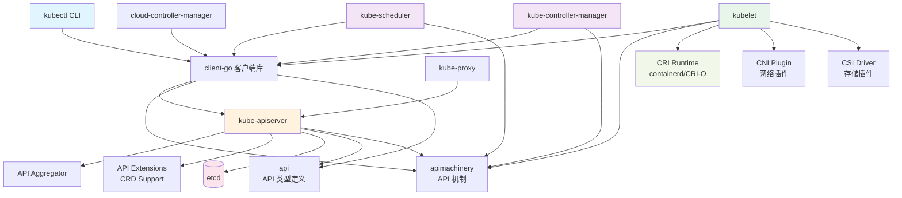
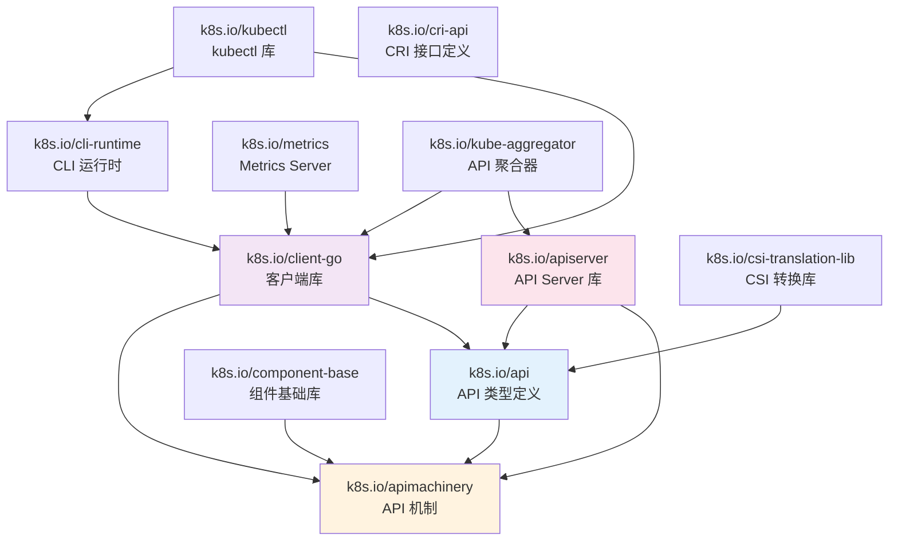
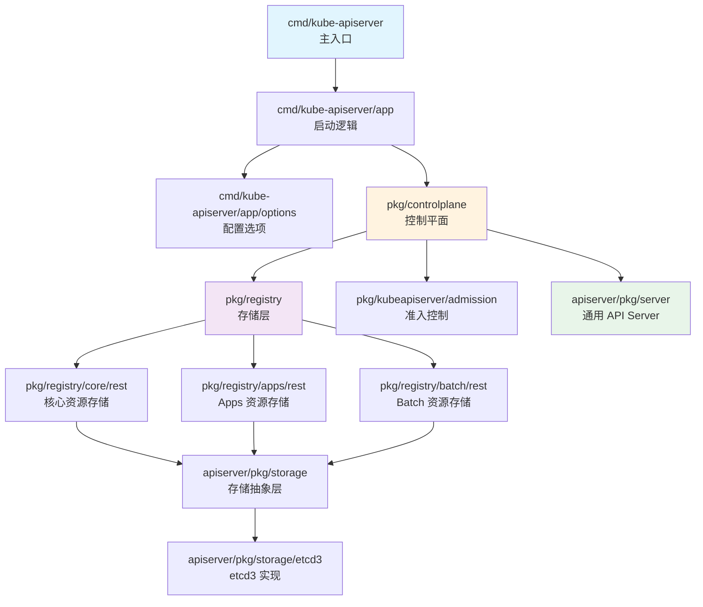
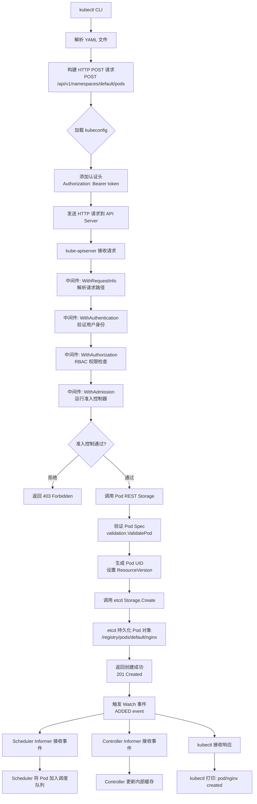
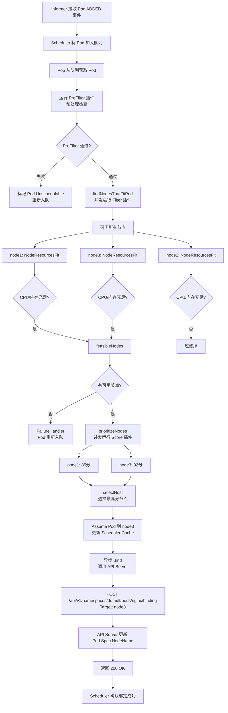
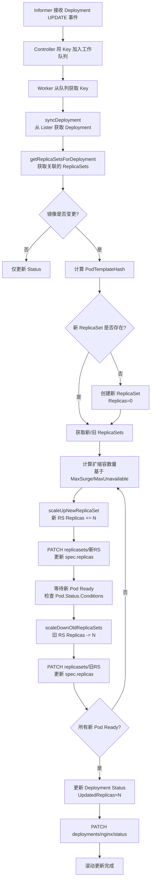
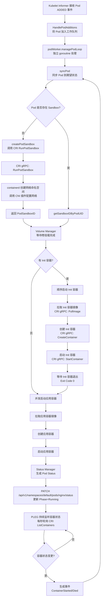
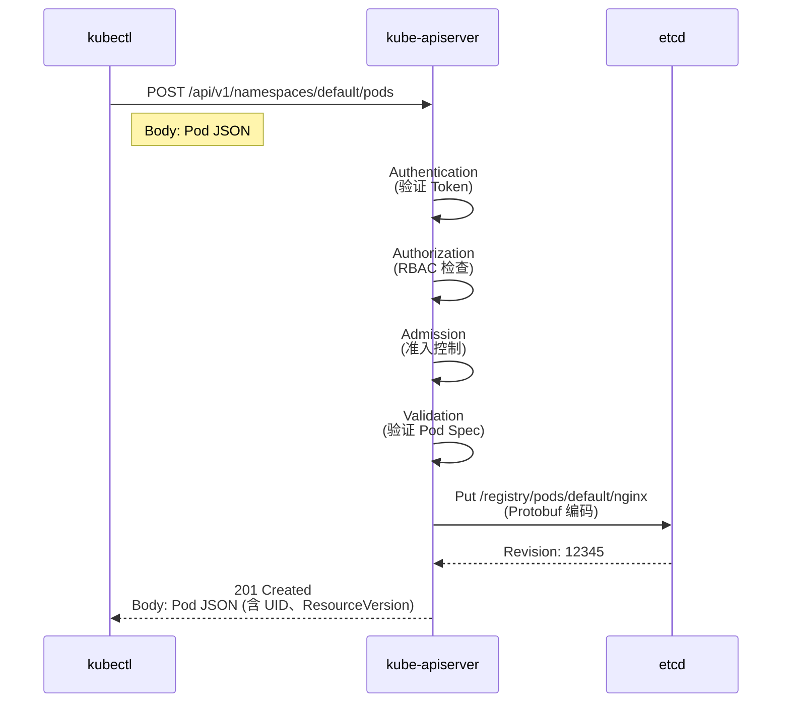
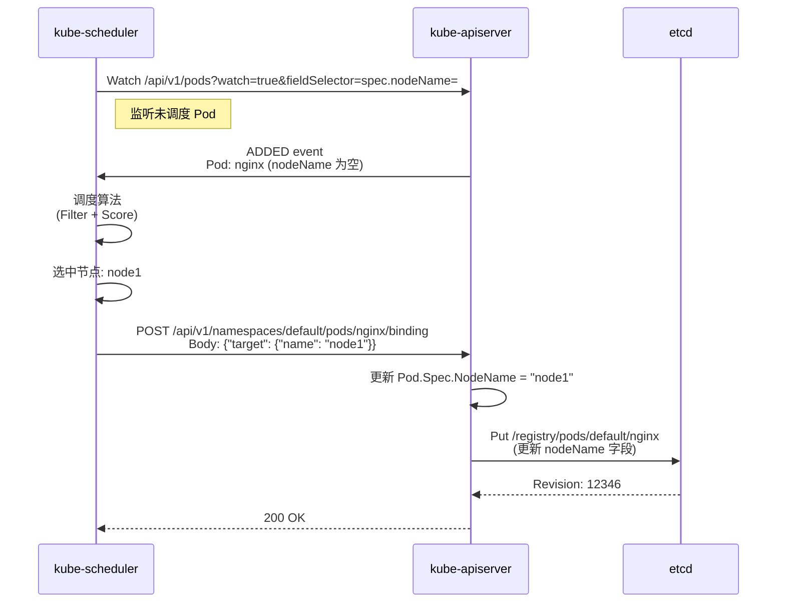
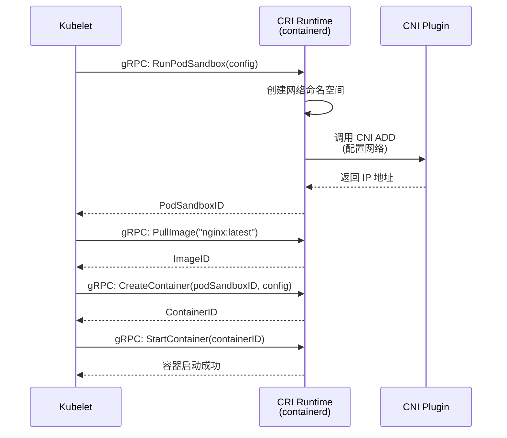

# Kubernetes 模块依赖与数据流

本文档详细分析 Kubernetes 的模块依赖关系、核心数据结构、API 接口和典型请求的处理流程。

---

## 一、模块依赖关系图

### 1.1 核心组件依赖关系



### 1.2 Staging 仓库依赖关系



### 1.3 内部包依赖关系（以 kube-apiserver 为例）



---

## 二、重要数据结构

### 2.1 核心 API 类型

#### Pod（核心工作负载单元）

**文件**: `staging/src/k8s.io/api/core/v1/types.go:5380`

```go
type Pod struct {
    metav1.TypeMeta   `json:",inline"`        // 类型元数据（Kind: "Pod", APIVersion: "v1"）
    metav1.ObjectMeta `json:"metadata,omitempty"` // 对象元数据（Name、Namespace、Labels 等）

    Spec   PodSpec   `json:"spec,omitempty"`   // 期望状态（容器定义、卷挂载等）
    Status PodStatus `json:"status,omitempty"` // 当前状态（Phase、Conditions、容器状态等）
}
```

**职责**:
- **Spec**: 用户声明的期望状态，由 kubectl/Controller 写入
- **Status**: 实际运行状态，由 Kubelet 上报并更新
- **TypeMeta**: 标识资源类型（用于序列化/反序列化）
- **ObjectMeta**: 存储元数据（Name、UID、ResourceVersion、Labels、Annotations）

**关键子结构**:

```go
type PodSpec struct {
    Containers       []Container       // 应用容器列表
    InitContainers   []Container       // 初始化容器（顺序执行）
    Volumes          []Volume          // 卷定义
    NodeName         string            // 调度到的节点名（由 Scheduler 写入）
    RestartPolicy    RestartPolicy     // 重启策略（Always/OnFailure/Never）
    ServiceAccountName string          // ServiceAccount 名称
    Priority         *int32            // 优先级（用于调度抢占）
    SchedulerName    string            // 调度器名称（支持多调度器）
    Tolerations      []Toleration      // 容忍度（容忍节点污点）
    Affinity         *Affinity         // 亲和性/反亲和性规则
}

type PodStatus struct {
    Phase             PodPhase          // Pod 阶段（Pending/Running/Succeeded/Failed/Unknown）
    Conditions        []PodCondition    // 条件列表（PodScheduled/Initialized/ContainersReady/Ready）
    ContainerStatuses []ContainerStatus // 容器状态列表
    PodIP             string            // Pod IP 地址
    HostIP            string            // 宿主机 IP 地址
    StartTime         *metav1.Time      // Pod 启动时间
}
```

---

#### Deployment（声明式应用部署）

**文件**: `staging/src/k8s.io/api/apps/v1/types.go:300`

```go
type Deployment struct {
    metav1.TypeMeta   `json:",inline"`
    metav1.ObjectMeta `json:"metadata,omitempty"`

    Spec   DeploymentSpec   `json:"spec,omitempty"`   // 期望状态（副本数、更新策略等）
    Status DeploymentStatus `json:"status,omitempty"` // 当前状态（可用副本数、条件等）
}

type DeploymentSpec struct {
    Replicas             *int32                 // 期望副本数
    Selector             *metav1.LabelSelector  // Pod 选择器
    Template             corev1.PodTemplateSpec // Pod 模板
    Strategy             DeploymentStrategy     // 更新策略（RollingUpdate/Recreate）
    MinReadySeconds      int32                  // Pod 最小就绪时间
    RevisionHistoryLimit *int32                 // 保留的历史版本数（默认 10）
    Paused               bool                   // 是否暂停（暂停滚动更新）
    ProgressDeadlineSeconds *int32              // 进度截止时间（超时则标记失败）
}

type DeploymentStrategy struct {
    Type          DeploymentStrategyType      // 策略类型
    RollingUpdate *RollingUpdateDeployment    // 滚动更新配置
}

type RollingUpdateDeployment struct {
    MaxUnavailable *intstr.IntOrString  // 最大不可用 Pod 数（数字或百分比）
    MaxSurge       *intstr.IntOrString  // 最大超出期望数的 Pod 数
}
```

**职责**:
- **Replicas**: 控制期望的 Pod 副本数
- **Selector**: 通过标签选择器管理 ReplicaSet
- **Template**: 定义 Pod 模板（包含容器、卷等）
- **Strategy**: 控制滚动更新行为（灰度发布、蓝绿部署等）

---

#### Service（服务发现与负载均衡）

**文件**: `staging/src/k8s.io/api/core/v1/types.go:4200`

```go
type Service struct {
    metav1.TypeMeta   `json:",inline"`
    metav1.ObjectMeta `json:"metadata,omitempty"`

    Spec   ServiceSpec   `json:"spec,omitempty"`
    Status ServiceStatus `json:"status,omitempty"`
}

type ServiceSpec struct {
    Selector          map[string]string  // Pod 选择器（通过标签匹配后端 Pod）
    Type              ServiceType        // 服务类型（ClusterIP/NodePort/LoadBalancer/ExternalName）
    ClusterIP         string             // 集群内虚拟 IP（由系统分配）
    ExternalIPs       []string           // 外部 IP 列表
    Ports             []ServicePort      // 端口映射列表
    SessionAffinity   ServiceAffinity    // 会话亲和性（ClientIP/None）
    LoadBalancerIP    string             // 负载均衡器 IP（云平台提供）
    ExternalName      string             // 外部 DNS 名称（Type=ExternalName 时使用）
}

type ServicePort struct {
    Name       string             // 端口名称
    Protocol   Protocol           // 协议（TCP/UDP/SCTP）
    Port       int32              // 服务端口
    TargetPort intstr.IntOrString // 目标 Pod 端口（可以是端口号或名称）
    NodePort   int32              // NodePort（Type=NodePort 时使用）
}
```

**职责**:
- **Selector**: 动态发现后端 Pod（通过 Endpoints Controller 维护 Endpoints 对象）
- **Type**: 决定服务暴露方式（集群内/节点端口/负载均衡器）
- **ClusterIP**: 提供稳定的虚拟 IP（由 kube-proxy 维护 iptables/ipvs 规则）

---

### 2.2 元数据类型（apimachinery）

#### ObjectMeta（对象元数据）

**文件**: `staging/src/k8s.io/apimachinery/pkg/apis/meta/v1/types.go:111`

```go
type ObjectMeta struct {
    Name                       string               // 对象名称（命名空间内唯一）
    Namespace                  string               // 命名空间（默认 default）
    UID                        types.UID            // 唯一标识符（UUID）
    ResourceVersion            string               // 资源版本（乐观并发控制，etcd Revision）
    Generation                 int64                // 期望状态版本（Spec 变更时递增）
    CreationTimestamp          Time                 // 创建时间
    DeletionTimestamp          *Time                // 删除时间（非空表示正在删除）
    DeletionGracePeriodSeconds *int64               // 优雅删除周期
    Labels                     map[string]string    // 标签（用于选择器、分组）
    Annotations                map[string]string    // 注解（存储元数据、配置）
    OwnerReferences            []OwnerReference     // 所有者引用（用于级联删除、垃圾回收）
    Finalizers                 []string             // Finalizer 列表（阻止删除直到清理完成）
    ManagedFields              []ManagedFieldsEntry // 管理字段（Server-Side Apply）
}
```

**职责**:
- **Name/Namespace**: 标识对象（namespace + name 唯一）
- **UID**: 全局唯一标识（即使 Name 相同，UID 也不同）
- **ResourceVersion**: 乐观锁版本号（etcd 的 Revision，用于 Watch 和冲突检测）
- **Labels**: 用于 Selector 查询（如 Service Selector、Deployment Selector）
- **Annotations**: 存储非标识性元数据（如工具配置、审计信息）
- **OwnerReferences**: 建立对象间所有权关系（如 Pod 的 Owner 是 ReplicaSet）
- **Finalizers**: 实现资源清理逻辑（如删除 PVC 前先卸载卷）

---

#### ListOptions（列表查询选项）

**文件**: `staging/src/k8s.io/apimachinery/pkg/apis/meta/v1/types.go:326`

```go
type ListOptions struct {
    TypeMeta `json:",inline"`

    LabelSelector        string  // 标签选择器（如 "app=nginx,env=prod"）
    FieldSelector        string  // 字段选择器（如 "status.phase=Running"）
    Watch                bool    // 是否监听变更（启用 Watch 模式）
    AllowWatchBookmarks  bool    // 是否允许 Watch Bookmark 事件
    ResourceVersion      string  // 起始版本（Watch 模式起点）
    ResourceVersionMatch ResourceVersionMatch // 版本匹配策略
    TimeoutSeconds       *int64  // 超时时间（秒）
    Limit                int64   // 分页限制（返回最多 N 个对象）
    Continue             string  // 分页继续标记（下一页的 Token）
}
```

**职责**:
- **LabelSelector**: 基于标签过滤（支持 `=`、`!=`、`in`、`notin` 等操作符）
- **FieldSelector**: 基于字段过滤（如 `metadata.name`、`status.phase`）
- **Watch**: 启用事件流模式（返回 Added/Modified/Deleted/Bookmark 事件）
- **Limit/Continue**: 实现分页（避免大列表一次性返回）

---

### 2.3 调度器核心数据结构

#### SchedulingQueue（调度队列）

**文件**: `pkg/scheduler/backend/queue/scheduling_queue.go`

```go
type SchedulingQueue interface {
    Add(pod *v1.Pod) error                  // 添加待调度 Pod
    Pop() (*framework.QueuedPodInfo, error) // 弹出优先级最高的 Pod（阻塞）
    Update(oldPod, newPod *v1.Pod) error    // 更新 Pod
    Delete(pod *v1.Pod) error               // 删除 Pod

    MoveAllToActiveOrBackoffQueue(event framework.ClusterEvent, preCheck PreEnqueueCheck) // 批量激活 Pod
    AssignedPodAdded(pod *v1.Pod)           // 通知 Pod 已调度
    AssignedPodUpdated(pod *v1.Pod)         // 通知 Pod 已更新

    Run()                                   // 启动队列（goroutine）
    Close()                                 // 关闭队列
}
```

**内部实现**（PriorityQueue）:
- **activeQ**: 活跃队列（堆结构，按优先级排序）
- **backoffQ**: 退避队列（调度失败的 Pod，等待重试）
- **unschedulablePods**: 不可调度队列（等待集群状态变更）

**职责**:
- **优先级排序**: 按 Pod.Spec.Priority 排序（高优先级 Pod 优先调度）
- **退避重试**: 调度失败后按指数退避重新入队
- **事件驱动**: 集群事件（如新增节点）触发 Pod 重新入队

---

#### NodeInfo（节点信息快照）

**文件**: `pkg/scheduler/backend/cache/cache.go`

```go
type NodeInfo struct {
    node *v1.Node                    // 节点对象
    Pods []*framework.PodInfo        // 节点上运行的 Pod 列表

    Requested        *framework.Resource  // 已请求的资源（CPU、内存、存储等）
    NonZeroRequested *framework.Resource  // 非零请求资源
    Allocatable      *framework.Resource  // 可分配资源

    Generation int64                     // 版本号（用于缓存失效）
}
```

**职责**:
- **资源跟踪**: 记录节点已使用和可用资源
- **Pod 列表**: 快照节点上所有 Pod（用于调度决策）
- **快速查询**: 避免每次调度都查询 API Server

---

### 2.4 控制器核心数据结构

#### WorkQueue（工作队列）

**文件**: `staging/src/k8s.io/client-go/util/workqueue/rate_limiting_queue.go`

```go
type RateLimitingInterface interface {
    AddAfter(item interface{}, duration time.Duration)  // 延迟添加
    AddRateLimited(item interface{})                    // 限速添加（带退避）
    Forget(item interface{})                            // 忘记速率限制
    NumRequeues(item interface{}) int                   // 查询重试次数

    Add(item interface{})                               // 基础队列方法
    Len() int
    Get() (item interface{}, shutdown bool)
    Done(item interface{})
    ShutDown()
}
```

**职责**:
- **去重**: 同一个 Key 只在队列中出现一次
- **限速**: 失败后按指数退避重试（5ms → 10ms → 20ms → ...）
- **延迟**: 支持定时重新入队（如定期调谐）

---

#### Informer（事件监听器）

**文件**: `staging/src/k8s.io/client-go/tools/cache/shared_informer.go`

```go
type SharedInformer interface {
    AddEventHandler(handler ResourceEventHandler) (ResourceEventHandlerRegistration, error)
    AddEventHandlerWithResyncPeriod(handler ResourceEventHandler, resyncPeriod time.Duration) (ResourceEventHandlerRegistration, error)

    GetStore() Store                    // 获取本地缓存
    GetController() Controller          // 获取控制器
    Run(stopCh <-chan struct{})         // 启动 Informer
    HasSynced() bool                    // 缓存是否已同步
}

type ResourceEventHandler interface {
    OnAdd(obj interface{}, isInInitialList bool)       // 添加事件
    OnUpdate(oldObj, newObj interface{})               // 更新事件
    OnDelete(obj interface{})                          // 删除事件
}
```

**职责**:
- **Watch API Server**: 监听资源变更（基于 HTTP Chunked Encoding）
- **本地缓存**: 维护资源的内存索引（Indexer）
- **事件分发**: 触发注册的 EventHandler

---

### 2.5 存储层数据结构

#### Storage.Interface（存储抽象接口）

**文件**: `staging/src/k8s.io/apiserver/pkg/storage/interfaces.go`

```go
type Interface interface {
    Versioner() Versioner              // 版本管理器
    Create(ctx context.Context, key string, obj, out runtime.Object, ttl uint64) error
    Delete(ctx context.Context, key string, out runtime.Object, preconditions *Preconditions, validateDeletion ValidateObjectFunc, cachedExistingObject runtime.Object) error
    Watch(ctx context.Context, key string, opts ListOptions) (watch.Interface, error)
    Get(ctx context.Context, key string, opts GetOptions, objPtr runtime.Object) error
    GetList(ctx context.Context, key string, opts ListOptions, listObj runtime.Object) error
    GuaranteedUpdate(ctx context.Context, key string, destination runtime.Object, ignoreNotFound bool, preconditions *Preconditions, tryUpdate UpdateFunc, cachedExistingObject runtime.Object) error
    Count(key string) (int64, error)
}
```

**实现**: `staging/src/k8s.io/apiserver/pkg/storage/etcd3/store.go`

**职责**:
- **CRUD 操作**: 封装 etcd clientv3 API
- **Watch 机制**: 实现 Watch 事件流（基于 etcd Watch）
- **乐观并发**: 基于 ResourceVersion 的 Compare-And-Swap
- **Transformer**: 支持数据加密（静态数据加密）

---

## 三、典型请求处理流程

### 3.1 创建 Pod 流程（kubectl create）

#### 输入
- **CLI 命令**: `kubectl create -f pod.yaml`
- **输入数据**: YAML 文件（包含 Pod 定义）

#### 处理层



#### 数据流

| 步骤 | 层级 | 输入 | 输出 | 关键函数 |
|------|------|------|------|----------|
| 1. 解析 | kubectl | YAML 文件 | Pod 对象（Go struct） | `kubectl/pkg/cmd/create/create.go` |
| 2. 序列化 | client-go | Pod 对象 | JSON 字节流 | `client-go/rest/request.go:Do()` |
| 3. 认证 | API Server | HTTP 请求 + Token | UserInfo | `apiserver/pkg/endpoints/filters/authentication.go` |
| 4. 授权 | API Server | UserInfo + 资源 | Allow/Deny | `apiserver/pkg/endpoints/filters/authorization.go` |
| 5. 准入 | API Server | Pod 对象 | 修改后的 Pod | `apiserver/pkg/admission/handler.go` |
| 6. 验证 | Registry | Pod 对象 | 错误列表 | `pkg/apis/core/validation/validation.go` |
| 7. 持久化 | etcd Storage | Pod 对象 | etcd Revision | `apiserver/pkg/storage/etcd3/store.go:Create()` |
| 8. Watch | Informer | etcd 事件 | ADDED 事件 | `client-go/tools/cache/reflector.go` |

---

### 3.2 调度 Pod 流程（Scheduler）

#### 输入
- **事件源**: Informer 监听到 `Pod.Spec.NodeName == ""`

#### 处理层



#### 数据流

| 步骤 | 层级 | 输入 | 输出 | 关键函数 |
|------|------|------|------|----------|
| 1. 入队 | Scheduler Queue | Pod 对象 | QueuedPodInfo | `pkg/scheduler/backend/queue/scheduling_queue.go:Add()` |
| 2. 出队 | Scheduler | 空 | 最高优先级 Pod | `pkg/scheduler/backend/queue/scheduling_queue.go:Pop()` |
| 3. Filter | Framework | Pod + Node 列表 | 可用节点列表 | `pkg/scheduler/framework/runtime/framework.go:RunFilterPlugins()` |
| 4. Score | Framework | Pod + 可用节点 | 节点分数列表 | `pkg/scheduler/framework/runtime/framework.go:RunScorePlugins()` |
| 5. Bind | API Client | Pod + 目标节点 | 绑定结果 | `client-go/kubernetes/typed/core/v1/pod.go:Bind()` |

---

### 3.3 Deployment 滚动更新流程（Controller）

#### 输入
- **事件源**: Informer 监听到 `Deployment.Spec.Template.Spec.Containers[0].Image` 变更

#### 处理层



#### 数据流

| 步骤 | 层级 | 输入 | 输出 | 关键函数 |
|------|------|------|------|----------|
| 1. 监听 | Informer | Deployment 对象 | UPDATE 事件 | `client-go/tools/cache/shared_informer.go` |
| 2. 入队 | WorkQueue | Deployment Key | - | `client-go/util/workqueue/rate_limiting_queue.go` |
| 3. 同步 | Controller | Deployment Key | ReplicaSets 列表 | `pkg/controller/deployment/deployment_controller.go:syncDeployment()` |
| 4. 计算 | Controller | 当前/期望状态 | 扩缩容数量 | `pkg/controller/deployment/sync.go:sync()` |
| 5. 扩容 | API Client | 新 RS + 新副本数 | PATCH 响应 | `client-go/kubernetes/typed/apps/v1/replicaset.go:Update()` |
| 6. 缩容 | API Client | 旧 RS + 新副本数 | PATCH 响应 | 同上 |

---

### 3.4 Kubelet SyncPod 流程（节点侧）

#### 输入
- **事件源**: API Server 通知 Pod 绑定到当前节点

#### 处理层



#### 数据流

| 步骤 | 层级 | 输入 | 输出 | 关键函数 |
|------|------|------|------|----------|
| 1. 监听 | Informer | Pod 对象 | ADDED 事件 | `client-go/tools/cache/shared_informer.go` |
| 2. 分发 | PodWorkers | Pod 对象 | 独立 goroutine | `pkg/kubelet/pod_workers.go:UpdatePod()` |
| 3. 创建沙箱 | CRI Runtime | Pod 配置 | PodSandboxID | `pkg/kubelet/kuberuntime/kuberuntime_sandbox.go:createPodSandbox()` |
| 4. 挂载卷 | Volume Manager | Pod + 卷列表 | 挂载路径 | `pkg/kubelet/volumemanager/volume_manager.go` |
| 5. 拉取镜像 | CRI Runtime | 镜像名称 | 镜像 ID | `pkg/kubelet/kuberuntime/kuberuntime_image.go:PullImage()` |
| 6. 启动容器 | CRI Runtime | 容器配置 | ContainerID | `pkg/kubelet/kuberuntime/kuberuntime_container.go:startContainer()` |
| 7. 上报状态 | Status Manager | Pod 状态 | PATCH 响应 | `pkg/kubelet/status/status_manager.go:SetPodStatus()` |

---

## 四、API 接口清单

### 4.1 核心 API 组（/api/v1）

| 路径 | 方法 | 资源类型 | 入参 | 出参 | 中间件 |
|------|------|----------|------|------|--------|
| `/api/v1/namespaces/{ns}/pods` | GET | Pod | ListOptions（Query） | PodList（JSON） | Authentication → Authorization → Audit |
| `/api/v1/namespaces/{ns}/pods` | POST | Pod | Pod（JSON Body） | Pod（JSON） | Authentication → Authorization → Admission → Audit |
| `/api/v1/namespaces/{ns}/pods/{name}` | GET | Pod | GetOptions（Query） | Pod（JSON） | Authentication → Authorization → Audit |
| `/api/v1/namespaces/{ns}/pods/{name}` | PUT | Pod | Pod（JSON Body） | Pod（JSON） | Authentication → Authorization → Admission → Audit |
| `/api/v1/namespaces/{ns}/pods/{name}` | PATCH | Pod | Patch（JSON/Merge/Strategic） | Pod（JSON） | Authentication → Authorization → Admission → Audit |
| `/api/v1/namespaces/{ns}/pods/{name}` | DELETE | Pod | DeleteOptions（Query） | Status（JSON） | Authentication → Authorization → Admission → Audit |
| `/api/v1/namespaces/{ns}/pods/{name}/status` | GET | Pod/status | - | Pod（JSON） | Authentication → Authorization → Audit |
| `/api/v1/namespaces/{ns}/pods/{name}/status` | PATCH | Pod/status | Patch（JSON） | Pod（JSON） | Authentication → Authorization → Audit |
| `/api/v1/namespaces/{ns}/pods/{name}/binding` | POST | Pod/binding | Binding（JSON） | Binding（JSON） | Authentication → Authorization → Audit |
| `/api/v1/namespaces/{ns}/pods/{name}/log` | GET | Pod/log | LogOptions（Query） | 文本流 | Authentication → Authorization |
| `/api/v1/namespaces/{ns}/pods/{name}/exec` | GET | Pod/exec | ExecOptions（Query） | WebSocket/SPDY | Authentication → Authorization |
| `/api/v1/namespaces/{ns}/services` | GET | Service | ListOptions | ServiceList | Authentication → Authorization → Audit |
| `/api/v1/namespaces/{ns}/services` | POST | Service | Service（JSON） | Service（JSON） | Authentication → Authorization → Admission → Audit |
| `/api/v1/namespaces/{ns}/endpoints` | GET | Endpoints | ListOptions | EndpointsList | Authentication → Authorization → Audit |
| `/api/v1/namespaces/{ns}/configmaps` | GET | ConfigMap | ListOptions | ConfigMapList | Authentication → Authorization → Audit |
| `/api/v1/namespaces/{ns}/secrets` | GET | Secret | ListOptions | SecretList | Authentication → Authorization → Audit |
| `/api/v1/nodes` | GET | Node | ListOptions | NodeList | Authentication → Authorization → Audit |
| `/api/v1/nodes/{name}` | GET | Node | GetOptions | Node（JSON） | Authentication → Authorization → Audit |
| `/api/v1/nodes/{name}/status` | PATCH | Node/status | Patch（JSON） | Node（JSON） | Authentication → Authorization → Audit |

**Query 参数示例**:
- **ListOptions**: `?labelSelector=app=nginx&fieldSelector=status.phase=Running&limit=100&watch=true`
- **LogOptions**: `?container=nginx&follow=true&tailLines=100&timestamps=true`

---

### 4.2 Apps API 组（/apis/apps/v1）

| 路径 | 方法 | 资源类型 | 入参 | 出参 | 中间件 |
|------|------|----------|------|------|--------|
| `/apis/apps/v1/namespaces/{ns}/deployments` | GET | Deployment | ListOptions | DeploymentList | Authentication → Authorization → Audit |
| `/apis/apps/v1/namespaces/{ns}/deployments` | POST | Deployment | Deployment（JSON） | Deployment（JSON） | Authentication → Authorization → Admission → Audit |
| `/apis/apps/v1/namespaces/{ns}/deployments/{name}` | GET | Deployment | GetOptions | Deployment（JSON） | Authentication → Authorization → Audit |
| `/apis/apps/v1/namespaces/{ns}/deployments/{name}` | PUT | Deployment | Deployment（JSON） | Deployment（JSON） | Authentication → Authorization → Admission → Audit |
| `/apis/apps/v1/namespaces/{ns}/deployments/{name}` | PATCH | Deployment | Patch | Deployment（JSON） | Authentication → Authorization → Admission → Audit |
| `/apis/apps/v1/namespaces/{ns}/deployments/{name}/status` | PATCH | Deployment/status | Patch | Deployment（JSON） | Authentication → Authorization → Audit |
| `/apis/apps/v1/namespaces/{ns}/deployments/{name}/scale` | GET | Deployment/scale | - | Scale（JSON） | Authentication → Authorization → Audit |
| `/apis/apps/v1/namespaces/{ns}/deployments/{name}/scale` | PATCH | Deployment/scale | Scale（JSON） | Scale（JSON） | Authentication → Authorization → Audit |
| `/apis/apps/v1/namespaces/{ns}/replicasets` | GET | ReplicaSet | ListOptions | ReplicaSetList | Authentication → Authorization → Audit |
| `/apis/apps/v1/namespaces/{ns}/statefulsets` | GET | StatefulSet | ListOptions | StatefulSetList | Authentication → Authorization → Audit |
| `/apis/apps/v1/namespaces/{ns}/daemonsets` | GET | DaemonSet | ListOptions | DaemonSetList | Authentication → Authorization → Audit |

---

### 4.3 Batch API 组（/apis/batch/v1）

| 路径 | 方法 | 资源类型 | 入参 | 出参 | 中间件 |
|------|------|----------|------|------|--------|
| `/apis/batch/v1/namespaces/{ns}/jobs` | GET | Job | ListOptions | JobList | Authentication → Authorization → Audit |
| `/apis/batch/v1/namespaces/{ns}/jobs` | POST | Job | Job（JSON） | Job（JSON） | Authentication → Authorization → Admission → Audit |
| `/apis/batch/v1/namespaces/{ns}/cronjobs` | GET | CronJob | ListOptions | CronJobList | Authentication → Authorization → Audit |

---

### 4.4 Metrics & Discovery API

| 路径 | 方法 | 描述 | 入参 | 出参 | 中间件 |
|------|------|------|------|------|--------|
| `/metrics` | GET | Prometheus 指标 | - | 文本格式（Prometheus） | - |
| `/healthz` | GET | 健康检查 | - | `ok`（文本） | - |
| `/healthz/etcd` | GET | etcd 健康检查 | - | `ok`（文本） | - |
| `/healthz/ping` | GET | Ping 检查 | - | `ok`（文本） | - |
| `/livez` | GET | 存活检查 | - | JSON | - |
| `/readyz` | GET | 就绪检查 | - | JSON | - |
| `/openapi/v2` | GET | OpenAPI Spec v2 | - | JSON（Swagger） | - |
| `/openapi/v3` | GET | OpenAPI Spec v3 | - | JSON（OpenAPI 3.0） | - |
| `/api` | GET | API 版本发现 | - | APIVersions（JSON） | - |
| `/apis` | GET | API 组发现 | - | APIGroupList（JSON） | - |
| `/version` | GET | 版本信息 | - | Version（JSON） | - |

---

### 4.5 中间件执行顺序

所有 API 请求都经过以下中间件链（按顺序）：

```
HTTP Request
  ↓
1. WithPanicRecovery         ← 捕获 panic，返回 500 错误
  ↓
2. WithRequestInfo           ← 解析请求信息（资源类型、动词、命名空间）
  ↓
3. WithMaxInFlightLimit      ← 限流（最大并发请求数）
  ↓
4. WithTimeoutForNonLongRunningRequests  ← 超时控制（默认 60s）
  ↓
5. WithAuthentication        ← 【关键】认证（Token/证书/OIDC）
  ↓
6. WithAudit                 ← 审计日志记录（请求元数据）
  ↓
7. WithAuthorization         ← 【关键】授权（RBAC/ABAC/Webhook）
  ↓
8. WithImpersonation         ← 用户伪装（Impersonate-User 头）
  ↓
9. WithAdmission             ← 【关键】准入控制（Validating/Mutating Webhook）
  ↓
10. RouteHandler             ← 路由到具体 REST Storage
  ↓
HTTP Response
```

**关键中间件说明**:

| 中间件 | 文件 | 职责 | 失败响应 |
|--------|------|------|----------|
| WithAuthentication | `apiserver/pkg/endpoints/filters/authentication.go` | 验证用户身份（从 Token/证书提取 UserInfo） | 401 Unauthorized |
| WithAuthorization | `apiserver/pkg/endpoints/filters/authorization.go` | 检查用户权限（基于 RBAC 规则） | 403 Forbidden |
| WithAdmission | `apiserver/pkg/admission/handler.go` | 运行准入控制器（如 PodSecurityPolicy、ResourceQuota） | 400 Bad Request / 403 Forbidden |
| WithAudit | `apiserver/pkg/endpoints/filters/audit.go` | 记录审计事件（请求/响应日志） | - |

---

## 五、数据持久化与存储

### 5.1 etcd 存储结构

Kubernetes 在 etcd 中的键命名空间结构：

```
/registry/
  ├── pods/
  │   ├── default/
  │   │   ├── nginx              ← Pod 对象（Protobuf 编码）
  │   │   └── redis
  │   └── kube-system/
  │       ├── kube-proxy-abcd
  │       └── kube-apiserver-xyz
  │
  ├── services/
  │   ├── default/
  │   │   └── kubernetes         ← Service 对象
  │   └── kube-system/
  │       └── kube-dns
  │
  ├── deployments/
  │   └── default/
  │       └── nginx
  │
  ├── replicasets/
  │   └── default/
  │       ├── nginx-5d4cf56db7
  │       └── nginx-84b5f6f9c8
  │
  ├── configmaps/
  │   └── default/
  │       └── app-config
  │
  ├── secrets/
  │   └── default/
  │       └── db-password        ← Secret 对象（可选加密）
  │
  └── ...
```

**存储特性**:
- **键格式**: `/registry/{资源复数名}/{命名空间}/{对象名}`
- **编码**: Protobuf（高效）或 JSON（调试模式）
- **加密**: 可选静态数据加密（使用 KMS 或 AES-CBC）
- **版本**: 每次更新递增 ResourceVersion（etcd Revision）

---

### 5.2 Watch 机制

**实现原理**:
1. **客户端**: 发起 HTTP GET 请求 `?watch=true&resourceVersion=12345`
2. **API Server**: 保持连接（HTTP Chunked Encoding）
3. **etcd**: Watch 指定前缀的键（如 `/registry/pods/`）
4. **事件流**: etcd 变更 → API Server 过滤/转换 → 客户端接收 JSON 事件

**事件类型**:
- **ADDED**: 新增对象
- **MODIFIED**: 更新对象
- **DELETED**: 删除对象
- **BOOKMARK**: 版本书签（用于恢复 Watch）
- **ERROR**: 错误事件（如 Watch 过期）

**示例事件**:
```json
{
  "type": "ADDED",
  "object": {
    "kind": "Pod",
    "apiVersion": "v1",
    "metadata": {
      "name": "nginx",
      "namespace": "default",
      "resourceVersion": "12346"
    },
    "spec": { ... },
    "status": { ... }
  }
}
```

---

## 六、关键模块交互总结

### 6.1 kubectl → API Server → etcd



---

### 6.2 Scheduler → API Server



---

### 6.3 Kubelet → CRI Runtime



---

## 七、性能优化与缓存

### 7.1 Informer 本地缓存

**目的**: 减少对 API Server 的查询压力

**实现**:
- **Reflector**: 从 API Server List&Watch 资源
- **Store**: 本地内存存储（支持按 Namespace、Label 索引）
- **Controller**: 分发事件到注册的 Handler

**优势**:
- Controller 查询资源时直接读本地缓存（不访问 API Server）
- Watch 机制保证缓存实时同步

---

### 7.2 Scheduler Cache

**目的**: 避免每次调度都查询 API Server

**实现**:
- **NodeInfo**: 缓存节点信息（可用资源、运行的 Pod）
- **AssumePod**: 乐观假设 Pod 已绑定（避免调度重复）
- **PLEG 更新**: Kubelet 上报 Pod 状态后更新缓存

---

### 7.3 API Server 缓存

**实现**:
- **Watch Cache**: API Server 内置缓存（List 请求从缓存读取）
- **etcd Compaction**: 定期压缩 etcd 历史版本（避免空间膨胀）

---

## 八、总结

### 8.1 核心设计模式

1. **声明式 API**: 用户声明期望状态，控制器负责调谐
2. **最终一致性**: 接受短暂不一致，通过持续调谐达到一致
3. **事件驱动**: Informer + WorkQueue 实现高效事件处理
4. **乐观并发**: 基于 ResourceVersion 的 Compare-And-Swap
5. **插件化**: Scheduler Plugins、Admission Webhooks、CSI/CNI/CRI

### 8.2 数据流总结

| 流向 | 发起方 | 目标 | 协议 | 数据格式 |
|------|--------|------|------|----------|
| kubectl → API Server | kubectl | kube-apiserver | HTTP/REST | JSON |
| API Server → etcd | kube-apiserver | etcd | gRPC | Protobuf |
| Controller → API Server | kube-controller-manager | kube-apiserver | HTTP/REST | JSON |
| Scheduler → API Server | kube-scheduler | kube-apiserver | HTTP/REST | JSON |
| Kubelet → API Server | kubelet | kube-apiserver | HTTP/REST | JSON |
| Kubelet → CRI | kubelet | containerd | gRPC | Protobuf |
| API Server → Controller (Watch) | kube-apiserver | kube-controller-manager | HTTP Stream | JSON |

### 8.3 学习建议

1. **从 API 类型入手**: 理解 Pod、Deployment、Service 的数据结构
2. **跟踪单个请求**: 使用 `kubectl -v=8` 查看完整 HTTP 请求
3. **阅读 Informer 实现**: 理解事件驱动机制
4. **分析控制器模式**: Deployment Controller 是经典范例
5. **实验 etcd**: 使用 `etcdctl get /registry/pods/default/nginx --print-value-only | protoc --decode` 查看原始数据