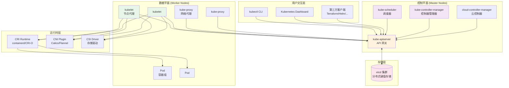
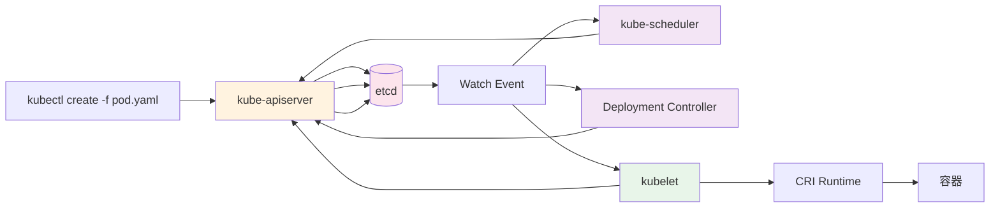
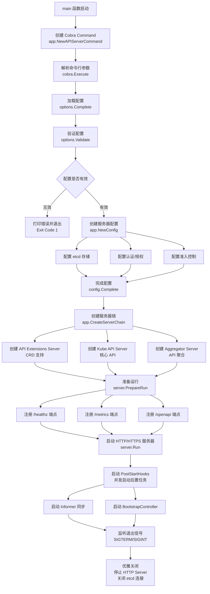
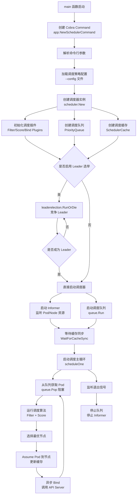
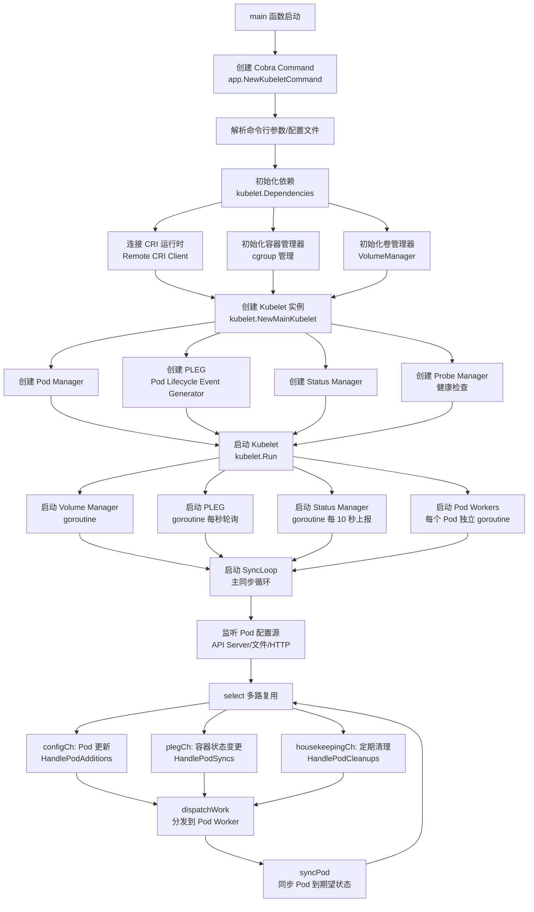
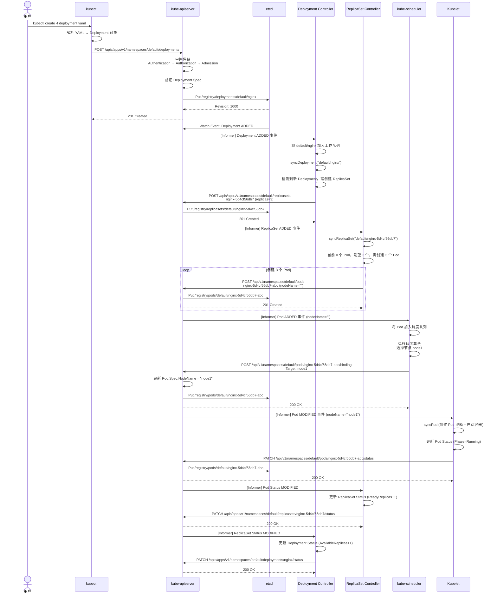
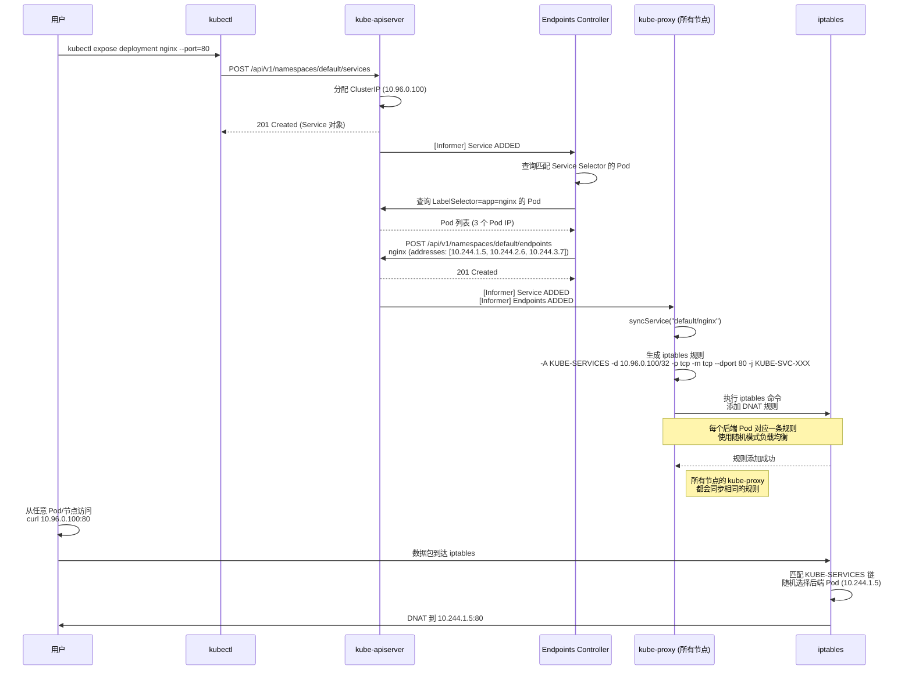
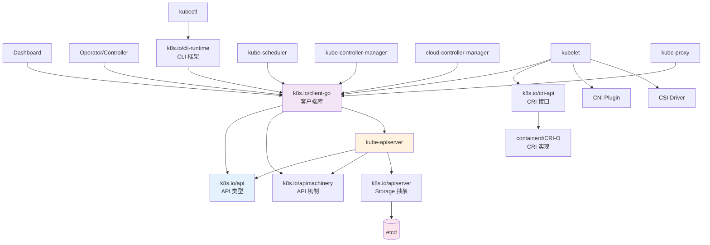
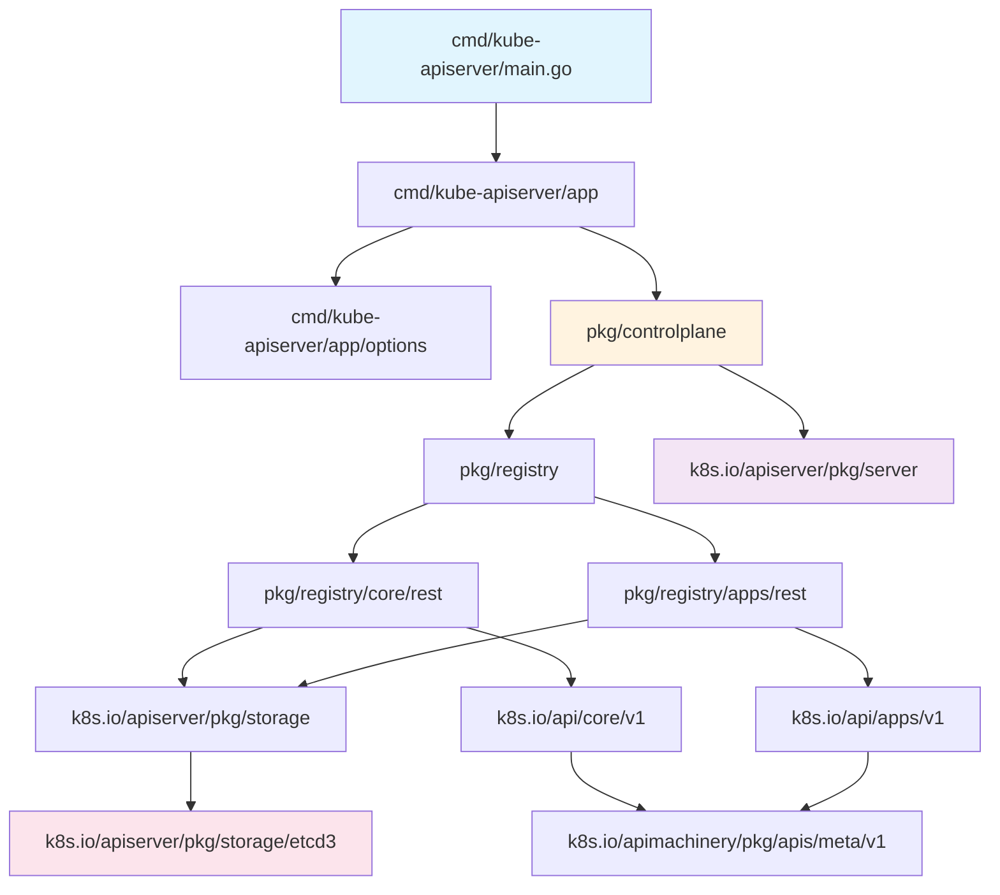
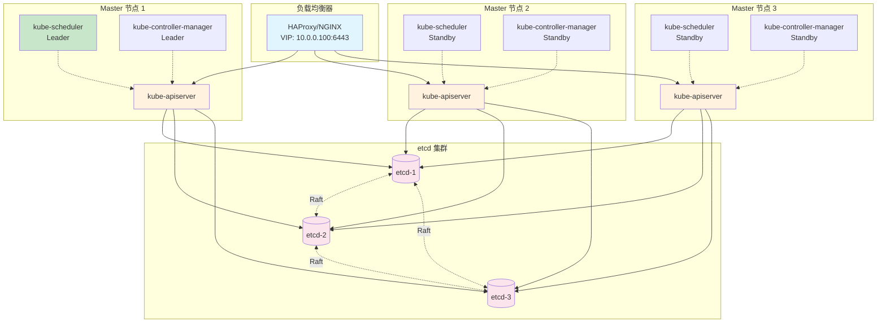

# Kubernetes 架构文档

本文档全面阐述 Kubernetes 的系统架构、组件交互、目录结构、启动流程、依赖关系和配置管理。

---

## 一、系统整体架构综述

### 1.1 架构概览

Kubernetes 是一个**声明式**、**分布式**的容器编排系统，采用**控制平面（Control Plane）+ 数据平面（Data Plane）** 的经典架构模式。



### 1.2 核心设计原则

| 设计原则 | 说明 | 实现方式 |
|----------|------|----------|
| **声明式 API** | 用户声明期望状态，系统自动调谐到该状态 | Spec/Status 分离，Controller 持续调谐 |
| **最终一致性** | 接受短暂不一致，通过异步调谐达到一致 | Informer + WorkQueue + Retry 机制 |
| **可扩展性** | 插件化架构，支持自定义扩展 | CRI/CNI/CSI、Scheduler Plugins、Admission Webhooks、CRD |
| **高可用性** | 控制平面无状态，支持多副本部署 | Leader 选举、etcd 集群、API Server 水平扩展 |
| **松耦合** | 组件通过 API Server 通信，避免直接依赖 | 统一 RESTful API、Watch 机制 |
| **自愈能力** | 自动检测并修复故障 | 控制器持续调谐、健康检查、Pod 重启策略 |

### 1.3 组件职责

#### 控制平面组件

| 组件 | 职责 | 高可用 | 部署位置 |
|------|------|--------|----------|
| **kube-apiserver** | ① 提供 RESTful API<br/>② 认证/授权/准入控制<br/>③ 数据持久化到 etcd<br/>④ Watch 事件分发 | ✅ 水平扩展（无状态） | Master 节点 |
| **kube-scheduler** | ① 监听未调度 Pod<br/>② 运行调度算法（Filter + Score）<br/>③ 绑定 Pod 到节点 | ✅ Leader 选举（单实例工作） | Master 节点 |
| **kube-controller-manager** | ① 运行 30+ 控制器<br/>② 监听资源变更<br/>③ 执行调谐逻辑 | ✅ Leader 选举 | Master 节点 |
| **cloud-controller-manager** | ① 与云平台交互<br/>② 管理节点/负载均衡器/路由 | ✅ Leader 选举 | Master 节点 |
| **etcd** | ① 存储集群状态<br/>② 提供 Watch 机制<br/>③ 分布式一致性保证 | ✅ Raft 协议（奇数节点） | 独立部署或与 Master 同节点 |

#### 数据平面组件

| 组件 | 职责 | 高可用 | 部署位置 |
|------|------|--------|----------|
| **kubelet** | ① 监听绑定到本节点的 Pod<br/>② 通过 CRI 管理容器生命周期<br/>③ 上报节点和 Pod 状态<br/>④ 执行健康检查 | ⚠️ 每节点一个实例 | 所有节点 |
| **kube-proxy** | ① 维护网络规则（iptables/ipvs）<br/>② 实现 Service 负载均衡<br/>③ 转发流量到后端 Pod | ⚠️ 每节点一个实例 | 所有节点 |
| **Container Runtime** | ① 拉取镜像<br/>② 创建/启动/停止容器<br/>③ 管理容器网络/存储 | ⚠️ 每节点一个实例 | 所有节点 |

#### 扩展组件（可选）

| 组件 | 职责 | 部署方式 |
|------|------|----------|
| **CoreDNS** | 集群内 DNS 服务 | Deployment（通常 2 副本） |
| **Metrics Server** | 资源使用指标（CPU/内存） | Deployment |
| **Ingress Controller** | HTTP/HTTPS 入口路由 | DaemonSet 或 Deployment |
| **CNI Plugin** | 容器网络配置 | 二进制文件 + DaemonSet |
| **CSI Driver** | 持久化存储管理 | StatefulSet + DaemonSet |

### 1.4 数据流向



**关键流程**:
1. **写入**: kubectl/Controller → API Server → etcd
2. **监听**: API Server ← etcd (Watch)
3. **事件分发**: API Server → Scheduler/Controller/Kubelet (HTTP Chunked)
4. **状态上报**: Kubelet → API Server → etcd

---

## 二、顶层目录结构

### 2.1 目录总览表

| 目录 | 作用 | 关键文件 | 说明 |
|------|------|----------|------|
| **`cmd/`** | 核心组件主入口（main 函数） | `kube-apiserver/apiserver.go`<br/>`kube-scheduler/scheduler.go`<br/>`kube-controller-manager/controller-manager.go`<br/>`kubelet/kubelet.go`<br/>`kubectl/kubectl.go`<br/>`kube-proxy/proxy.go` | 所有二进制程序的入口点，负责命令行解析和启动逻辑 |
| **`pkg/`** | 核心实现包（业务逻辑） | `pkg/scheduler/scheduler.go`<br/>`pkg/controller/deployment/deployment_controller.go`<br/>`pkg/kubelet/kubelet.go`<br/>`pkg/proxy/iptables/proxier.go`<br/>`pkg/registry/core/rest/storage_core.go` | Kubernetes 核心功能实现，包含所有控制器、调度器、存储层等 |
| **`staging/src/k8s.io/`** | 独立发布的子仓库（Staging 仓库） | `client-go/` (客户端库)<br/>`api/` (API 类型定义)<br/>`apimachinery/` (API 机制)<br/>`apiserver/` (API Server 库)<br/>`kubectl/` (kubectl 库) | 可独立发布到 `k8s.io/*`，供外部项目使用（如 Operator SDK） |
| **`api/`** | OpenAPI 规范与 API 定义 | `openapi-spec/swagger.json`<br/>`api/openapi-spec/v3/` | 自动生成的 OpenAPI/Swagger 文档，用于 API 发现和客户端生成 |
| **`test/`** | 测试代码 | `test/e2e/` (端到端测试)<br/>`test/integration/` (集成测试)<br/>`test/e2e_node/` (节点 E2E 测试) | 包含单元测试、集成测试、E2E 测试（基于 Ginkgo 框架） |
| **`hack/`** | 构建/测试/验证脚本 | `hack/make-rules/build.sh`<br/>`hack/make-rules/test.sh`<br/>`hack/verify-all.sh`<br/>`hack/update-vendor.sh`<br/>`hack/local-up-cluster.sh` | 开发工具集，包含代码生成、依赖更新、本地集群启动等脚本 |
| **`build/`** | 构建配置与容器化构建 | `build/root/Makefile`<br/>`build/run.sh` (容器化构建)<br/>`build/shell.sh` (进入构建容器) | Makefile、Docker 镜像定义、构建脚本 |
| **`cluster/`** | 集群部署脚本 | `cluster/gce/` (GCE 部署)<br/>`cluster/aws/` (AWS 部署)<br/>`cluster/local/` (本地部署) | 各种云平台和本地环境的部署脚本（已逐步迁移到 kubeadm） |
| **`vendor/`** | Go 依赖包（Vendoring） | 第三方依赖源码 | 通过 `go mod vendor` 生成，确保构建可重现 |
| **`third_party/`** | 第三方工具与库 | `third_party/forked/` (Fork 的外部代码)<br/>`third_party/protobuf/` | 非 Go 依赖、修改过的第三方代码 |
| **`plugin/`** | 插件示例与接口 | `plugin/pkg/admission/` (准入控制插件)<br/>`plugin/pkg/auth/` (认证插件) | 插件接口定义和示例实现（已逐步迁移到 staging） |
| **`docs/`** | 文档 | `docs/admin/` (管理员文档)<br/>`docs/design/` (设计文档) | 部分旧文档（主要文档在 kubernetes.io） |
| **`.github/`** | GitHub 配置 | `.github/workflows/` (CI/CD)<br/>`.github/ISSUE_TEMPLATE/` | GitHub Actions、Issue 模板、PR 模板 |
| **`CHANGELOG/`** | 变更日志 | `CHANGELOG-1.34.md` | 各版本的 Release Notes |
| **`LICENSES/`** | 许可证文件 | `LICENSE` (Apache 2.0)<br/>`LICENSES/vendor/` | 项目和依赖的许可证 |

### 2.2 核心目录深入解析

#### 2.2.1 `cmd/` 目录（主入口）

```
cmd/
├── kube-apiserver/
│   ├── apiserver.go              ← main 函数（入口点）
│   └── app/
│       ├── server.go             ← 启动逻辑（NewAPIServerCommand、Run）
│       └── options/
│           └── options.go        ← 命令行参数定义
│
├── kube-scheduler/
│   ├── scheduler.go              ← main 函数
│   └── app/
│       ├── server.go             ← 启动逻辑（NewSchedulerCommand、Run）
│       └── config/
│           └── config.go         ← 调度器配置
│
├── kube-controller-manager/
│   ├── controller-manager.go    ← main 函数
│   └── app/
│       ├── controllermanager.go ← 启动逻辑（StartControllers）
│       ├── apps.go               ← Apps 控制器注册
│       └── core.go               ← 核心控制器注册
│
├── kubelet/
│   ├── kubelet.go                ← main 函数
│   └── app/
│       ├── server.go             ← 启动逻辑（Run、RunKubelet）
│       └── options/
│           └── options.go        ← Kubelet 配置
│
└── kubectl/
    └── kubectl.go                ← main 函数（CLI 工具）
```

#### 2.2.2 `pkg/` 目录（核心实现）

```
pkg/
├── controller/                    ← 所有控制器实现
│   ├── deployment/
│   │   ├── deployment_controller.go  ← Deployment 控制器
│   │   ├── sync.go                   ← 同步逻辑
│   │   └── rolling.go                ← 滚动更新
│   ├── replicaset/
│   ├── statefulset/
│   ├── job/
│   └── ...
│
├── scheduler/                     ← 调度器实现
│   ├── scheduler.go               ← 调度器主逻辑
│   ├── framework/
│   │   ├── runtime/framework.go  ← 插件框架
│   │   └── plugins/              ← 内置插件
│   └── backend/
│       ├── cache/cache.go        ← 调度缓存
│       └── queue/scheduling_queue.go ← 调度队列
│
├── kubelet/                       ← Kubelet 实现
│   ├── kubelet.go                 ← Kubelet 核心逻辑
│   ├── kuberuntime/               ← CRI 运行时管理
│   ├── pod_workers.go             ← Pod Worker 管理
│   ├── pleg/                      ← Pod Lifecycle Event Generator
│   ├── volumemanager/             ← 卷管理器
│   └── status/                    ← 状态管理器
│
├── proxy/                         ← kube-proxy 实现
│   ├── iptables/proxier.go        ← iptables 模式
│   ├── ipvs/proxier.go            ← IPVS 模式
│   └── nftables/proxier.go        ← nftables 模式
│
├── registry/                      ← 存储层（RESTStorage）
│   ├── core/rest/                 ← 核心资源存储
│   │   ├── storage_core.go        ← 注册所有核心资源
│   │   └── storage_pods.go        ← Pod 存储实现
│   ├── apps/rest/                 ← Apps 资源存储
│   └── batch/rest/                ← Batch 资源存储
│
└── apis/                          ← 内部 API 类型
    ├── core/types.go              ← 核心资源内部类型
    └── core/validation/           ← API 验证逻辑
```

#### 2.2.3 `staging/` 目录（可独立发布）

```
staging/src/k8s.io/
├── api/                           ← API 类型定义（外部可用）
│   └── core/v1/types.go           ← Pod、Service 等类型
│
├── apimachinery/                  ← API 机制（元数据、序列化、转换）
│   └── pkg/apis/meta/v1/types.go  ← ObjectMeta、ListOptions
│
├── client-go/                     ← 客户端库（最常用）
│   ├── kubernetes/                ← Typed Client
│   ├── dynamic/                   ← Dynamic Client
│   ├── tools/cache/               ← Informer 机制
│   ├── tools/clientcmd/           ← kubeconfig 加载
│   └── util/workqueue/            ← WorkQueue 实现
│
├── apiserver/                     ← API Server 库
│   └── pkg/server/                ← GenericAPIServer 实现
│
├── kubectl/                       ← kubectl 实现
│   └── pkg/cmd/                   ← 所有 kubectl 子命令
│
└── component-base/                ← 组件基础库
    ├── cli/                       ← CLI 框架
    ├── metrics/                   ← Metrics 框架
    └── logs/                      ← 日志框架
```

---

## 三、启动流程图

### 3.1 kube-apiserver 启动流程



### 3.2 kube-scheduler 启动流程



### 3.3 kubelet 启动流程



---

## 四、核心调用链时序图

### 4.1 创建 Deployment 完整时序



### 4.2 Service 负载均衡流程



---

## 五、模块依赖关系图

### 5.1 组件间依赖关系



### 5.2 包依赖关系（内部）



---

## 六、外部依赖

### 6.1 核心外部依赖

| 依赖 | 类型 | 版本要求 | 用途 | 高可用 |
|------|------|----------|------|--------|
| **etcd** | 分布式键值数据库 | ≥ 3.5.0 | 存储集群状态（唯一真相源） | ✅ 奇数节点集群（3/5/7） |
| **Container Runtime** | 容器运行时 | CRI v1 | 管理容器生命周期 | ⚠️ 每节点单实例 |
| └─ containerd | 推荐运行时 | ≥ 1.6.0 | CNCF 毕业项目，轻量高效 | - |
| └─ CRI-O | 替代运行时 | ≥ 1.20.0 | 专为 Kubernetes 设计 | - |
| └─ Docker | 已弃用 | 通过 cri-dockerd | 需要额外的 shim 层 | - |

### 6.2 网络依赖（CNI 插件）

| CNI 插件 | 类型 | 网络模式 | 特性 |
|----------|------|----------|------|
| **Calico** | Overlay/BGP | VXLAN/IPIP/BGP | 支持网络策略、高性能 |
| **Flannel** | Overlay | VXLAN/Host-Gateway | 简单易用、轻量级 |
| **Cilium** | eBPF | eBPF | L7 感知、服务网格集成 |
| **Weave Net** | Overlay | VXLAN | 自动加密、无需外部数据库 |

**部署方式**:
- CNI 二进制: `/opt/cni/bin/` (calico、flannel 等)
- CNI 配置: `/etc/cni/net.d/` (JSON 配置文件)
- DaemonSet: 确保每个节点运行 CNI 守护进程

### 6.3 存储依赖（CSI 驱动）

| CSI 驱动 | 提供商 | 存储类型 | 部署方式 |
|----------|--------|----------|----------|
| **AWS EBS CSI** | AWS | 块存储 | StatefulSet (Controller) + DaemonSet (Node) |
| **GCE PD CSI** | GCP | 持久磁盘 | 同上 |
| **Azure Disk CSI** | Azure | 托管磁盘 | 同上 |
| **Ceph CSI** | Ceph | 分布式存储 | 同上 |
| **NFS CSI** | NFS | 网络文件系统 | 同上 |

### 6.4 可选外部依赖

| 依赖 | 用途 | 部署方式 |
|------|------|----------|
| **CoreDNS** | 集群内 DNS 解析 | Deployment (通常 2 副本) |
| **Metrics Server** | 资源指标收集（CPU/内存） | Deployment + API Service |
| **Prometheus** | 监控告警 | StatefulSet + Service |
| **Grafana** | 可视化仪表盘 | Deployment + Service |
| **Ingress Controller** | HTTP/HTTPS 入口 | DaemonSet 或 Deployment |
| └─ NGINX Ingress | 最常用 | DaemonSet (每节点) |
| └─ Traefik | 云原生 | Deployment + Service |
| **Cert Manager** | TLS 证书管理 | Deployment |
| **Istio** | 服务网格 | 多组件（Pilot、Envoy） |

### 6.5 开发/测试依赖

| 依赖 | 用途 | 安装方式 |
|------|------|----------|
| **Go** | 编译器 | 系统包管理器 / 官方安装包 |
| **Docker** | 容器化构建 | 官方安装脚本 |
| **kind** | 本地测试集群 | `go install sigs.k8s.io/kind@latest` |
| **kubeadm** | 集群初始化 | Kubernetes Release |
| **Ginkgo** | E2E 测试框架 | `go install github.com/onsi/ginkgo/v2/ginkgo@latest` |

### 6.6 依赖版本矩阵（Kubernetes 1.34）

| Kubernetes | etcd | Go | containerd | Docker (cri-dockerd) |
|------------|------|----|-----------|-----------------------|
| 1.34.x | ≥ 3.5.12 | 1.24.7 | ≥ 1.7.0 | 27.x (需 cri-dockerd) |
| 1.33.x | ≥ 3.5.10 | 1.23.x | ≥ 1.6.0 | 26.x |
| 1.32.x | ≥ 3.5.9 | 1.22.x | ≥ 1.6.0 | 25.x |

---

## 七、配置项详解

### 7.1 kube-apiserver 核心配置

| 配置项 | 类型 | 默认值 | 说明 |
|--------|------|--------|------|
| `--etcd-servers` | []string | - | **必需**。etcd 服务器地址列表（如 `https://127.0.0.1:2379`） |
| `--etcd-prefix` | string | `/registry` | etcd 键前缀 |
| `--secure-port` | int | 6443 | HTTPS API 端口 |
| `--bind-address` | string | `0.0.0.0` | 监听地址 |
| `--advertise-address` | string | - | 向集群成员通告的 IP（多网卡场景） |
| `--cert-dir` | string | `/var/run/kubernetes` | 证书目录 |
| `--tls-cert-file` | string | - | TLS 证书文件 |
| `--tls-private-key-file` | string | - | TLS 私钥文件 |
| `--client-ca-file` | string | - | 客户端 CA 证书（mTLS 认证） |
| `--service-account-key-file` | []string | - | ServiceAccount Token 签名公钥 |
| `--service-cluster-ip-range` | string | `10.96.0.0/12` | Service ClusterIP 范围 |
| `--authorization-mode` | []string | `AlwaysAllow` | 授权模式（常用: `Node,RBAC`） |
| `--enable-admission-plugins` | []string | - | 启用的准入控制器（如 `NamespaceLifecycle,LimitRanger,ServiceAccount`） |
| `--disable-admission-plugins` | []string | - | 禁用的准入控制器 |
| `--max-requests-inflight` | int | 400 | 最大并发只读请求数 |
| `--max-mutating-requests-inflight` | int | 200 | 最大并发写请求数 |
| `--runtime-config` | map | - | 启用/禁用 API 组（如 `api/all=false,api/v1=true`） |
| `--feature-gates` | map | - | 功能门控（如 `PodSecurity=true`） |

**完整配置示例**:
```bash
kube-apiserver \
  --etcd-servers=https://127.0.0.1:2379 \
  --etcd-cafile=/etc/kubernetes/pki/etcd/ca.crt \
  --etcd-certfile=/etc/kubernetes/pki/apiserver-etcd-client.crt \
  --etcd-keyfile=/etc/kubernetes/pki/apiserver-etcd-client.key \
  --secure-port=6443 \
  --bind-address=0.0.0.0 \
  --advertise-address=10.0.0.10 \
  --tls-cert-file=/etc/kubernetes/pki/apiserver.crt \
  --tls-private-key-file=/etc/kubernetes/pki/apiserver.key \
  --client-ca-file=/etc/kubernetes/pki/ca.crt \
  --service-account-key-file=/etc/kubernetes/pki/sa.pub \
  --service-account-signing-key-file=/etc/kubernetes/pki/sa.key \
  --service-account-issuer=https://kubernetes.default.svc.cluster.local \
  --service-cluster-ip-range=10.96.0.0/12 \
  --authorization-mode=Node,RBAC \
  --enable-admission-plugins=NodeRestriction,PodSecurity \
  --enable-bootstrap-token-auth=true \
  --allow-privileged=true
```

---

### 7.2 kube-scheduler 核心配置

| 配置项 | 类型 | 默认值 | 说明 |
|--------|------|--------|------|
| `--kubeconfig` | string | - | **必需**。API Server 连接配置 |
| `--config` | string | - | 调度策略配置文件（推荐） |
| `--leader-elect` | bool | `true` | 启用 Leader 选举（高可用） |
| `--leader-elect-lease-duration` | duration | `15s` | Leader 租约时长 |
| `--leader-elect-renew-deadline` | duration | `10s` | Leader 续约截止时间 |
| `--leader-elect-retry-period` | duration | `2s` | Leader 选举重试间隔 |
| `--bind-address` | string | `0.0.0.0` | Metrics/Healthz 监听地址 |
| `--secure-port` | int | 10259 | HTTPS 端口 |

**调度策略配置文件** (`KubeSchedulerConfiguration`):
```yaml
apiVersion: kubescheduler.config.k8s.io/v1
kind: KubeSchedulerConfiguration
clientConnection:
  kubeconfig: /etc/kubernetes/scheduler.conf
leaderElection:
  leaderElect: true
profiles:
- schedulerName: default-scheduler
  plugins:
    score:
      enabled:
      - name: NodeResourcesBalancedAllocation
        weight: 1
      - name: ImageLocality
        weight: 1
    filter:
      enabled:
      - name: NodeUnschedulable
      - name: NodeResourcesFit
      - name: NodeAffinity
  pluginConfig:
  - name: NodeResourcesFit
    args:
      scoringStrategy:
        type: LeastAllocated
        resources:
        - name: cpu
          weight: 1
        - name: memory
          weight: 1
```

---

### 7.3 kube-controller-manager 核心配置

| 配置项 | 类型 | 默认值 | 说明 |
|--------|------|--------|------|
| `--kubeconfig` | string | - | **必需**。API Server 连接配置 |
| `--leader-elect` | bool | `true` | 启用 Leader 选举 |
| `--controllers` | []string | `*` | 启用的控制器列表（`*` 表示所有） |
| `--cluster-cidr` | string | - | Pod CIDR 范围（用于 Node IPAM） |
| `--service-cluster-ip-range` | string | - | Service ClusterIP 范围 |
| `--node-cidr-mask-size` | int | `24` | 节点 CIDR 掩码大小 |
| `--concurrent-deployment-syncs` | int | `5` | Deployment 控制器并发数 |
| `--concurrent-replicaset-syncs` | int | `5` | ReplicaSet 控制器并发数 |
| `--concurrent-service-syncs` | int | `1` | Service 控制器并发数 |
| `--node-monitor-period` | duration | `5s` | 节点监控周期 |
| `--node-monitor-grace-period` | duration | `40s` | 节点宽限期（超时后标记 NotReady） |
| `--pod-eviction-timeout` | duration | `5m` | Pod 驱逐超时 |

---

### 7.4 kubelet 核心配置

| 配置项 | 类型 | 默认值 | 说明 |
|--------|------|--------|------|
| `--kubeconfig` | string | - | API Server 连接配置 |
| `--config` | string | - | Kubelet 配置文件（推荐） |
| `--container-runtime-endpoint` | string | `unix:///run/containerd/containerd.sock` | CRI 运行时 Socket |
| `--pod-manifest-path` | string | `/etc/kubernetes/manifests` | 静态 Pod 定义目录 |
| `--root-dir` | string | `/var/lib/kubelet` | Kubelet 工作目录 |
| `--node-ip` | string | - | 节点 IP（多网卡场景） |
| `--hostname-override` | string | - | 覆盖主机名 |
| `--cluster-dns` | []string | - | 集群 DNS 服务器地址（如 CoreDNS） |
| `--cluster-domain` | string | `cluster.local` | 集群域名 |
| `--max-pods` | int | `110` | 节点最大 Pod 数 |
| `--pod-infra-container-image` | string | `registry.k8s.io/pause:3.9` | Pause 容器镜像 |
| `--cgroup-driver` | string | `cgroupfs` | cgroup 驱动（systemd/cgroupfs） |

**Kubelet 配置文件** (`KubeletConfiguration`):
```yaml
apiVersion: kubelet.config.k8s.io/v1beta1
kind: KubeletConfiguration
authentication:
  anonymous:
    enabled: false
  webhook:
    enabled: true
authorization:
  mode: Webhook
clusterDNS:
- 10.96.0.10
clusterDomain: cluster.local
cgroupDriver: systemd
containerRuntimeEndpoint: unix:///run/containerd/containerd.sock
maxPods: 110
podCIDR: 10.244.0.0/24
resolvConf: /run/systemd/resolve/resolv.conf
rotateCertificates: true
runtimeRequestTimeout: 15m
serializeImagePulls: false
staticPodPath: /etc/kubernetes/manifests
```

---

### 7.5 kubectl 配置（kubeconfig）

**文件路径优先级**:
1. `--kubeconfig` 命令行参数
2. `$KUBECONFIG` 环境变量
3. `~/.kube/config` (默认)
4. In-cluster 配置 (`/var/run/secrets/kubernetes.io/serviceaccount/`)

**kubeconfig 结构**:
```yaml
apiVersion: v1
kind: Config
clusters:
- name: kubernetes
  cluster:
    server: https://10.0.0.10:6443
    certificate-authority-data: LS0tLS1CRUdJTi... (Base64 编码)
users:
- name: kubernetes-admin
  user:
    client-certificate-data: LS0tLS1CRUdJTi...
    client-key-data: LS0tLS1CRUdJTi...
contexts:
- name: kubernetes-admin@kubernetes
  context:
    cluster: kubernetes
    user: kubernetes-admin
    namespace: default
current-context: kubernetes-admin@kubernetes
```

---

### 7.6 功能门控（Feature Gates）

| 功能门控 | 状态 | 默认 | 说明 |
|----------|------|------|------|
| `PodSecurity` | GA | Enabled | Pod 安全策略（替代 PodSecurityPolicy） |
| `CSIMigration` | GA | Enabled | 将内置存储插件迁移到 CSI |
| `ServerSideApply` | GA | Enabled | 服务端 Apply（kubectl apply 新实现） |
| `EphemeralContainers` | GA | Enabled | 临时容器（用于调试） |
| `TopologyAwareHints` | Beta | Enabled | 拓扑感知提示（优化跨 AZ 流量） |
| `CronJobsScheduledAnnotation` | Beta | Enabled | CronJob 调度时间注解 |

**配置方式**:
```bash
kube-apiserver --feature-gates=PodSecurity=true,NewFeature=false
```

---

### 7.7 环境变量配置

| 环境变量 | 组件 | 说明 |
|----------|------|------|
| `KUBECONFIG` | kubectl | kubeconfig 文件路径 |
| `KUBERNETES_SERVICE_HOST` | In-cluster | API Server 地址（自动注入） |
| `KUBERNETES_SERVICE_PORT` | In-cluster | API Server 端口（自动注入） |
| `KUBE_CACHE_MUTATION_DETECTOR` | 所有 | 缓存突变检测器（开发模式） |
| `KUBE_FEATURE_GATES` | 所有 | 功能门控（覆盖命令行） |
| `HTTP_PROXY` | 所有 | HTTP 代理 |
| `HTTPS_PROXY` | 所有 | HTTPS 代理 |
| `NO_PROXY` | 所有 | 不使用代理的地址列表 |

---

## 八、高可用架构设计

### 8.1 控制平面高可用



**高可用关键点**:
1. **API Server**: 无状态，可水平扩展（通过负载均衡器分发请求）
2. **Scheduler/Controller Manager**: 有状态，使用 Leader 选举（基于 Lease 资源）
3. **etcd**: 使用 Raft 协议，奇数节点（3/5/7），超过半数节点存活即可工作
4. **负载均衡器**: HAProxy/NGINX/云厂商 LB，提供单一入口（VIP）

---

## 九、性能调优建议

### 9.1 etcd 优化

| 配置项 | 推荐值 | 说明 |
|--------|--------|------|
| `--quota-backend-bytes` | `8GB` | 存储配额（默认 2GB） |
| `--max-request-bytes` | `10MB` | 最大请求大小 |
| `--heartbeat-interval` | `100ms` | 心跳间隔 |
| `--election-timeout` | `1000ms` | 选举超时 |
| `--snapshot-count` | `10000` | 快照触发阈值 |
| `--auto-compaction-retention` | `1h` | 自动压缩历史版本 |

**硬件要求**:
- **CPU**: 4 核以上
- **内存**: 8GB 以上
- **磁盘**: **SSD**（关键，延迟 < 10ms）
- **网络**: 低延迟（< 1ms，最好同机房）

### 9.2 API Server 优化

| 配置项 | 推荐值 | 说明 |
|--------|--------|------|
| `--max-requests-inflight` | `800` | 增加并发限制（默认 400） |
| `--max-mutating-requests-inflight` | `400` | 增加写并发（默认 200） |
| `--watch-cache-sizes` | `资源=缓存大小` | 调整 Watch 缓存（如 `pods=1000`） |
| `--enable-priority-and-fairness` | `true` | 启用请求优先级（默认开启） |

### 9.3 Kubelet 优化

| 配置项 | 推荐值 | 说明 |
|--------|--------|------|
| `--max-pods` | `250` | 增加节点 Pod 上限（默认 110） |
| `--kube-api-qps` | `50` | 增加 API 请求 QPS（默认 10） |
| `--kube-api-burst` | `100` | 增加突发请求数（默认 20） |
| `--serialize-image-pulls` | `false` | 并发拉取镜像（默认串行） |
| `--image-pull-progress-deadline` | `10m` | 镜像拉取超时（默认 1m） |

---

## 十、总结

### 10.1 架构核心特点

1. **声明式设计**: 用户声明期望状态，系统持续调谐
2. **控制器模式**: 30+ 控制器独立运行，互不干扰
3. **事件驱动**: Informer + WorkQueue 实现高效异步处理
4. **松耦合**: 组件通过 API Server 通信，支持水平扩展
5. **可扩展性**: CRI/CNI/CSI、Scheduler Plugins、CRD、Webhooks

### 10.2 学习路径建议

1. **入门**: 理解 Pod、Deployment、Service 等核心概念
2. **深入**: 分析 Deployment Controller 的调谐逻辑
3. **进阶**: 研究 Scheduler 的调度算法和插件机制
4. **高级**: 实现自定义 Operator（基于 controller-runtime）
5. **专家**: 参与 Kubernetes 社区贡献

### 10.3 参考资源

- **官方文档**: https://kubernetes.io/docs/
- **API 参考**: https://kubernetes.io/docs/reference/kubernetes-api/
- **设计文档**: https://github.com/kubernetes/community/tree/master/contributors/design-proposals
- **源码仓库**: https://github.com/kubernetes/kubernetes
- **Slack 社区**: https://kubernetes.slack.com (#kubernetes-dev)